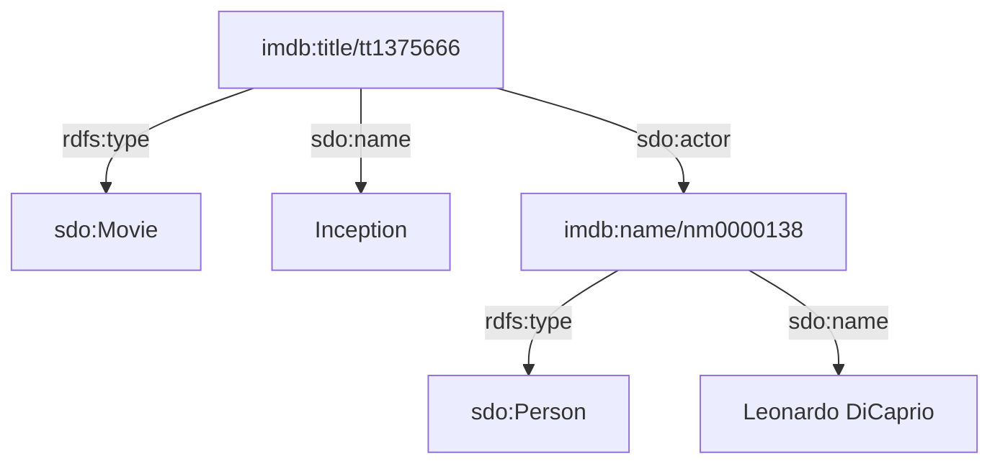

While Spinque users are accustomed to creating, enriching, and exploiting **Knowledge Graphs** to design custom search strategies, perhaps not many know how these graphs are handled under the hood by our engine. 

Physically, they are stored as a vast collection of **triples**—statements composed of a Subject, a Predicate, and an Object—and queried via SQL on [MonetDB](https://www.monetdb.org/). 

MonetDB is the perfect analytical engine for Spinque. Its column-oriented architecture enables the blazing fast construction and navigation of hundreds of knowledge graphs concurrently. However, at Spinque, we like to push the limits of performance. This drive made us rethink how the most problematic data type in any database could be handled even better: **strings**.

### The Burden of Strings in Knowledge Graphs

Knowledge graphs are incredibly verbose. Entities, attributes, relationships, and literals are typically represented by long URIs and textual descriptors. 

Consider a small portion of a graph representing a movie:

Stored natively as strings, these triples look like this:

| subject | predicate | object |
| :--- | :--- | :--- |
| `https://www.imdb.com/title/tt1375666` | `http://www.w3.org/1999/02/22-rdf-syntax-ns#type` | `https://schema.org/Movie` |
| `https://www.imdb.com/title/tt1375666` | `https://schema.org/name` | `"Inception"` |
| `https://www.imdb.com/title/tt1375666` | `https://schema.org/actor` | `https://www.imdb.com/name/nm0000138` |
| `https://www.imdb.com/name/nm0000138` | `http://www.w3.org/1999/02/22-rdf-syntax-ns#type` | `https://schema.org/Person` |
| `https://www.imdb.com/name/nm0000138` | `https://schema.org/name` | `"Leonardo DiCaprio"` |

If we store this directly as text (e.g. `VARCHAR`), the database wastes significant storage and memory duplicating identical strings. More importantly, executing search queries requires the database engine to compare strings character by character—a process significantly slower than comparing numbers. 

### The Current Optimization: Explicit Dictionary Encoding

To deliver the high-performance search our users expect, we currently overcome this by using **Explicit Dictionary Encoding (DE)** for the triples. 

During the ingestion process, we extract every unique string (both their string attributes and identifiers) into a central "Dictionary" table, assigning each a unique integer ID.

**The Dictionary:**

| id | value |
| :--- | :--- |
| `1` | `http://www.w3.org/1999/02/22-rdf-syntax-ns#type` |
| `2` | `https://schema.org/Movie` |
| `3` | `https://schema.org/name` |
| `4` | `https://schema.org/actor` |
| `5` | `https://schema.org/Person` |
| `6` | `https://www.imdb.com/title/tt1375666` |
| `7` | `https://www.imdb.com/name/nm0000138` |
| `8` | `"Inception"` |
| `9` | `"Leonardo DiCaprio"` |

We then store the Knowledge Graph purely as integers:

**The Triples:**

| subject | predicate | object |
| :--- | :--- | :--- |
| `6` | `1` | `2` |
| `6` | `3` | `8` |
| `6` | `4` | `7` |
| `7` | `1` | `5` |
| `7` | `3` | `9` |

This optimization is highly effective. Comparing integers is much, much faster than comparing strings, resulting in lightning-fast querying. However, this comes at a cost: every piece of data must be processed by complex ETL (Extract, Transform, Load) pipelines to maintain this mapping before the data can even be queried.

### The Future: Native String Efficiency

What if the database engine could perform this optimization automatically?

In a recent pursuit of an even better data engineering experience, we developed a proof-of-concept for a MonetDB data type that completely eliminates string duplication at the source. It introduces *native* Global Dictionary Encoding directly into the core of the database engine.

By offloading this complexity to the database, we can remove explicit dictionary encoding from our codebase entirely and use string triples exactly as they are. The database natively assigns universal integer IDs under the hood, ensuring that identical strings are stored only once and that all query operations (like joins and aggregations) are executed at the speed of integers.

### What Does This Mean for Spinque Users?

Continuing to innovate at the database level brings direct benefits to Spinque and our users:

*   **Faster Data Ingestion:** Removing the explicit dictionary encoding layer accelerates the time it takes to build or update search indexes. Fresh data becomes searchable faster.
*   **More Efficient Knowledge Graphs:** Native optimization systematically cuts database size by intelligently managing string storage, providing more scalable graphs.
*   **Quicker Responses & Better UX:** Accelerating low-level operations directly inside the database results in faster, more responsive custom search strategies for end users.

The results of this proof-of-concept have been highly encouraging: up to 30x faster string operations, storage space cut in half, and reduced data-to-graph transformation times.
We are now looking forward to a production-ready implementation, which we hope to make available to our users in the near future.

For a deep dive into the engineering details, benchmarks, and the technical implementation of this proof-of-concept, read our extended companion post: **[No Strings attached ... to SQL columns]()**.
