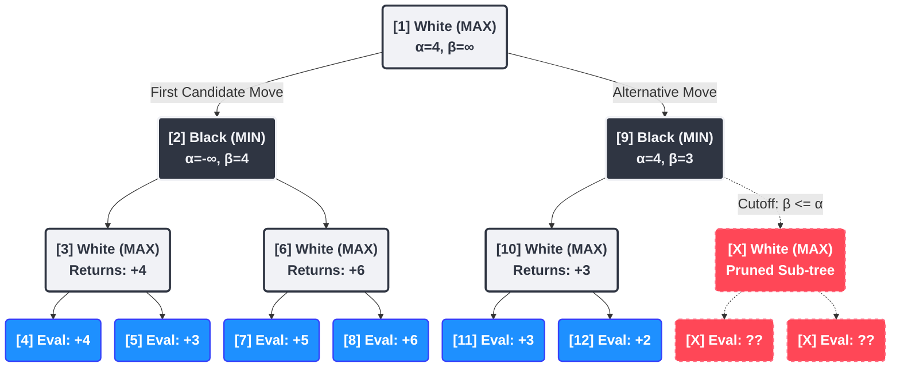

<div style="margin-bottom: 0;">
    
    <div style="text-align: right"><i><small>Image generated with Google Gemini</small></i></div>
</div>

I know what you're thinking: SQL is a terrible language for a chess engine. And you're right. It is inherently designed for set-based data retrieval, not for the highly branching, depth-first search of chess engines. My intention with Quack-Mate wasn't to dethrone Stockfish, but to explore a single, slightly mad question: just how far can we push a modern analytical database to play chess?

> **TL;DR:** Is it possible to build a playable chess engine in pure SQL? Though it's not trivial, the answer is "yes, with conditions". **Quack-Mate** explores the inevitable collision between the set-based execution models of database engines and the sequential, depth-first reasoning required for efficient chess.
<br>
<br>
A playable compromise between these two opposing forces requires trading off both the algorithmic superiority of traditional engines and the raw data-crunching throughput of modern analytical databases. The result is a functional engine that proves an 'unsuitable' paradigm can be stretched to perform—and a clear-eyed look at exactly why the divide between sets and trees runs so deep.

Here is the Quack-Mate user interface in action. You can [play the WebAssembly (WASM)](https://swingbit.github.io/quack-mate/) version online in your browser (not from your phone, sorry), or [run the interface locally](https://github.com/swingbit/quack-mate) using the native Node.js DuckDB driver for a significant performance boost. As the engine thinks, the interface exposes the exact SQL queries executing under the hood in real-time, alongside checkboxes to toggle specific move ordering or lossy pruning heuristics and a complete breakdown of detailed search statistics:


<div style="text-align: center; margin: -1rem 0 2rem 0; font-family: system-ui, -apple-system, sans-serif; display: flex; justify-content: center; align-items: center; gap: 2rem;">
    <a href="https://swingbit.github.io/quack-mate/" target="_blank" style="font-weight: 600; text-decoration: none; color: #2563eb; display: inline-flex; align-items: center; gap: 0.5rem;">
        
        Play Quack-Mate Online
    </a>
    <a href="https://github.com/swingbit/quack-mate" target="_blank" style="font-weight: 600; text-decoration: none; color: #2563eb; display: inline-flex; align-items: center; gap: 0.5rem;">
        <i class="svg-icon github" style="width: 45px; height: 45px; vertical-align: middle; margin: 0; display: inline-block; background-size: contain; background-repeat: no-repeat; background-position: center;"></i>
        GitHub Repository
    </a>
</div>

If you have played a few games and explored the source code, you might wonder why anyone would choose to build a chess engine this way. For me, it began with a simple realisation: it seemed nobody had done it before—at least, not like this. While there have been a few attempts to implement chess in databases, they typically rely heavily on procedural extensions like Oracle's PL/SQL or PostgreSQL's PL/pgSQL (with explicit loops and variables), or they are written as C extensions. Implementing a fully functioning chess engine purely through relational algebra and standard SQL queries on a modern analytical engine (like the brilliant DuckDB) felt like uncharted territory.

Modern analytical engines like DuckDB are absolute beasts at crunching numbers in high volumes. Exploring the immense tree of chess possibilities immediately brings to mind joining a table of 'boards' with a table of 'all possible moves' to create a new generation of boards. If a pure SQL formulation is possible, you get the tremendous benefits of advanced database engines for free: brutal query optimisation and vectorised parallelisation over millions of rows.

But why is raw efficiency so heavily emphasised in chess programming? It comes down to a computational challenge known as combinatorial explosion. From the starting position, White has 20 possible moves, and Black has 20 responses, meaning there are 400 possible games after just one full turn. After three full turns, there are over 119 million possible games. After just four full turns (8 plies), the game tree explodes to roughly 85 billion possible games! To play well, an engine must look as far ahead into these exponentially growing branches as possible. Therefore, in chess engines, speed directly translates to search depth, and depth translates directly into playing strength.

## Anatomy of a Chess Engine (and How SQL Handles It)

Before diving into the complex queries, it helps to understand the basic components of a traditional chess engine and how Quack-Mate translates them into the language of relational databases.

### Board Representation & Bitboards

The absolute foundation of any engine is how it "sees" the game. A highly optimised state representation is critical because the engine will need to store, copy, and evaluate millions of these states per second during a deep search.

Before we talk about moving pieces, we have to talk about how the board is stored. A chess board has 64 squares. By a happy coincidence of computing history, modern CPU registers are standardly 64 bits wide. 

Modern chess engines use **Bitboards**: 64-bit integers where each bit represents a square on the board (1 if occupied, 0 if empty). Instead of keeping one big array that says "Square E4 houses a White Pawn", engines maintain separate bitboards for each piece type. You need 12 in total: White Pawns, White Knights, Black Pawns... all the way to Black Kings.

Using Bitboards means answering chess questions becomes highly efficient bitwise math. 

All the White Pawns are identified by a specific bitboard:
```
wP_bb
```

Where are *all* the white pieces?
```
w_bb = wP_bb | wN_bb | ... | wK_bb
```
 
Is that square empty?
```
((w_bb | b_bb) & square_mask) == 0
```

Want to flip the presence of a White Knight on a specific square?
```
wN_bb ^ square_mask
```

This is how modern engines evaluate positions millions of times per second.

To replicate this state-of-the-art representation in a database, we hit an immediate wall. Standard SQL *does not have* unsigned 64-bit integers. 

One option is to use SQL bitstring types (like PostgreSQL's `BIT(64)`), which natively allow manipulating 64 bits correctly. However, these are generally much less efficient than native integer types when performing large-scale operations. Alternatively, we could use a standard signed `BIGINT` (like `int8` in PostgreSQL). However, a signed 64-bit integer uses the 64th bit as the sign bit. The primary issue this introduces is with the right-shift operator (`>>`), which performs an arithmetic shift (propagating the sign bit) instead of a logical shift. Painstakingly using a signed `BIGINT` is possible, but it requires injecting computationally expensive masking conditions into every query just to isolate and handle the sign bit correctly. 

Alternatively, you could reach for larger or non-standard SQL data types, but this solution isn't optimal either:
- **ClickHouse**: The leader in this space, offering native 128-bit (`UInt128`) and even 256-bit unsigned integers.
- **MonetDB**: Offers a native 128-bit `HUGEINT` type. An early prototype of Quack-Mate actually supported both DuckDB and MonetDB (using the `HUGEINT` type), as they both are high-performance analytical engines.
- **Snowflake**: Its primary numeric type is `NUMBER`, but its internal engine and bitwise functions (like `BITAND`, `BITSHIFTLEFT`) actually operate on and return signed 128-bit integers.
- **PostgreSQL (via Extension)**: While lacking native support in core, the specialised `pg-uint128` extension adds unsigned 128-bit integers (which can introduce query execution overhead when processing operations over non-native extension types).

This is precisely where DuckDB shines. I eventually focussed on it because it hits the exact sweet spot: it provides native `UBIGINT` support to avoid 128-bit overhead, while its high-performance analytical engine allows us to process massive game trees entirely in-process. While a few other databases also support unsigned 64-bit integers (such as MySQL, MariaDB, and ClickHouse), DuckDB’s unique architecture provides the perfect environment for a SQL-based engine to prove its worth.

By storing the entire game state as a single database row containing 12 `UBIGINT` columns, we can finally translate chess computations into pure, vectorised SQL operations. The mechanical efficiency of bitboards is most striking when moving a piece down the search tree. Instead of looping over a traditional array to painstakingly clear "Square A1" and write to "Square A2", a move mathematically distils down to two simple square-presence flips. By applying two bitwise `XOR` operations against the original bitboard—one to toggle off the "from" square, and one to toggle on the "to" square—the piece instantly teleports to its new destination.

In short: `board ^= (square_from | square_to)`:


Because DuckDB supports these bitwise operators natively on unsigned integers, the analytical engine can execute these binary flips across millions of rows simultaneously:

```sql
-- Applying a move to the white pawns bitboard
SELECT 
    -- XORing the combined (OR'd) masks toggles both squares at once
    xor(s.wP_bb, (deltaFrom_mask | deltaTo_mask)) AS wP_bb
FROM current_states s
-- (This happens concurrently for all 12 piece column types)
```


### Pseudo-Move Generation

To look into the future, the engine must systematically generate all possible next moves from a given position. Building the massive tree of variations starts here. These generated moves are "pseudo-legal". This means they follow the basic geometric movement rules of the pieces (e.g., a bishop moving diagonally), but they don't yet account for complex board state rules, like whether making that move would illegally expose the player's own King to check.


#### The Imperative Approach
While modern engines don't naively loop over all 64 squares, they *do* iterate piece-by-piece.

<details markdown="1">
<summary class="tech-detail">🛠️ Click to expand technical details</summary>

They grab the bitboard for a specific piece type (like Knights), use hardware instructions to find the first set bit (the square the piece is on), and then loop over its pre-calculated "mobility mask"—a bitboard showing every legally reachable square from that position regardless of whether an enemy piece is there or not—to generate moves.

```cpp
// Generating pseudo-legal moves (imperative bitboard engine)
U64 knights = board.white_knights_bb;

// Loop over every knight we have
while (knights) {
    // Hardware instruction finds the piece's square index
    int sq = pop_lsb(&knights); 
    
    // Look up the mobility mask and loop over every reachable target square
    U64 valid_destinations = KNIGHT_MOBILITY[sq] & ~board.own_pieces_bb;
    while (valid_destinations) {
        int target_sq = pop_lsb(&valid_destinations);
        add_move(move_list, sq, target_sq);
    }
}
// ... repeat this entire process for Bishops, Rooks, Queens, etc.
```
</details>


#### The Relational Approach
Generating next moves isn't done piece-by-piece; it's a massive, concurrent `JOIN` operation. Quack-Mate supports all standard legal chess moves—including castling and pawn promotions—with the sole exception of the en-passant rule. While essential for full FIDE compliance, tracking the transient history-dependent state required for en-passant in pure SQL adds substantial query and schema complexity to the move generator. To keep the relational joins and database schema as clean and streamlined as possible, en-passant is currently omitted from the move generator.

<details markdown="1">
<summary class="tech-detail">🛠️ Click to expand technical details</summary>

We pre-compute these masks for every piece on every square and store them as two static lookup tables: `mobility_precomputed` (showing where a piece can legally move) and `attacks_precomputed` (a separate table necessary specifically for Pawns, which move forward but capture diagonally). We explode the current game state out into all its pieces and join them with the pre-computed mobility tables to instantly spawn rows for every possible pseudo-legal continuation for *all* pieces simultaneously.

The `JOIN LATERAL` pattern acts as our primary move generator. It iterates over a 64-row `squares` table, using a nested `CASE WHEN` to check the active turn at the top level. This allows DuckDB to instantly short-circuit and skip checking the inactive player's bitboards entirely. Active piece squares are identified and directly joined to `mobility_precomputed` on unsigned piece equality (`mp.piece = pt.piece`) to leverage static indices, while empty squares are filtered instantly at the join boundary via `pt.piece IS NOT NULL`.

```sql
SELECT 
    s.id AS parent_id, sq.i AS from_sq, m.target_sq AS to_sq, 
    (pt.piece * s.active_turn)::TINYINT AS piece
FROM squares sq
-- CROSS JOIN s -- (when bulk processing)

-- 1. Explode: Find occupied squares and identify pieces using a nested turn check
JOIN LATERAL (
    SELECT (CASE WHEN s.active_turn = 1 THEN
        (CASE 
            WHEN is_bit_set(s.wN_bb, sq.i) THEN 2
            WHEN is_bit_set(s.wB_bb, sq.i) THEN 3
            WHEN is_bit_set(s.wR_bb, sq.i) THEN 4
            WHEN is_bit_set(s.wQ_bb, sq.i) THEN 5
            WHEN is_bit_set(s.wK_bb, sq.i) THEN 6
        END)
    ELSE
        (CASE 
            WHEN is_bit_set(s.bN_bb, sq.i) THEN 2
            WHEN is_bit_set(s.bB_bb, sq.i) THEN 3
            WHEN is_bit_set(s.bR_bb, sq.i) THEN 4
            WHEN is_bit_set(s.bQ_bb, sq.i) THEN 5
            WHEN is_bit_set(s.bK_bb, sq.i) THEN 6
        END)
    END) AS piece
) pt ON pt.piece IS NOT NULL

-- 2. Join Mobility
JOIN mobility_precomputed m ON m.from_sq = sq.i AND m.piece = pt.piece
WHERE (m.ray_mask & s.all_pieces_bb) = 0 
  AND NOT is_bit_set(s.my_pieces_bb, m.target_sq)

UNION ALL

-- 3. Generate pawn captures separately using attack masks
SELECT 
    s.id AS parent_id, sq.i AS from_sq, a.target_sq AS to_sq, 1 AS piece
FROM current_states s
JOIN LATERAL (SELECT 1 AS piece WHERE is_bit_set(s.wP_bb, sq.i)) p ON true
JOIN attacks_precomputed a ON a.from_sq = sq.i AND a.piece = p.piece
-- Pawn attacks are only valid legal moves if an opponent piece is actually there to capture!
WHERE is_bit_set(s.opponent_pieces_bb, a.target_sq) 
```
</details>


### Is the King in Check? (Move Validation)

Chess rules forbid making a move that leaves your own King under attack. "Pseudo-move generation" creates moves based on piece logic, but "validation" acts as the strict filter that tosses out the illegal ones before they pollute the search tree.

> Checking legality normally requires calculating complex "pin masks". SQL is terrible at this. To bypass it, we reverse the math: instead of tracking protecting pieces, we check if our King could theoretically attack the enemy piece in return.

#### The Imperative Approach
Modern engines use fast bitwise math on the *current* board state to check legality, rather than making and un-making moves.

<details markdown="1">
<summary class="tech-detail">🛠️ Click to expand technical details</summary>

While older or simpler engines might literally "make the move, check if the king is attacked, take it back," this is way too slow for a modern engine. Modern engines pre-calculate an "absolute pin mask" for pieces defending the king and evaluate if a proposed move violates a pin or places the King onto an attacked square, usually doing this validation lazily right before the move is searched.

```cpp
// Fast bitwise legality test on the current state (modern imperative)
bool is_legal(Board board, Move move) {
    if (piece_type(move) == KING) {
        return !is_square_attacked(board, to_sq(move), opponent);
    }
    // If piece is pinned, it can only move along the pinning ray.
    // (A jumping Knight's move will never align, cleanly returning false).
    if ((board.pinned_mask & (1ULL << from_sq(move)))) {
        return aligned(from_sq(move), to_sq(move), board.king_sq);
    }
    // ... en-passant edge cases
    return true;
}
```
</details>


#### The Relational Approach
Quack-Mate embraces the brute force of set theory by applying all moves simultaneously and then filtering the illegal ones via a "backwards" attack check.

<details markdown="1">
<summary class="tech-detail">🛠️ Click to expand technical details</summary>

Calculating absolute pin masks dynamically in pure SQL is incredibly inefficient. Instead, Quack-Mate skips pre-validation: we *apply* all pseudo-legal moves in bulk to spawn a CTE of `expanded_states`, then filter the illegal boards. 

While classical engines maintain a single board state and sequentially "make" and "un-make" moves in a loop to conserve memory, SQL excels at generating massive sets of independent, immutable rows simultaneously. 

To filter out the illegal states without complex pin-masks, we check legality concurrently using a "backwards" attack check: we trace attacks in reverse starting from the King's square. By executing an `EXISTS` subquery that bitwise `AND`s precomputed attack masks against the unexploded enemy bitboards, we compress a massive, multi-row O(N) piece-explosion per state into a fast O(1) lookup.


```sql
SELECT * FROM expanded_states m
-- Filter out the rows where the King is left under attack
WHERE NOT EXISTS (
    SELECT 1 FROM attacks_precomputed ap 
    WHERE ap.square = m.king_sq
    AND (
        -- If we conceptually place a Knight on the King's square, does it hit an enemy Knight?
        (m.enemy_knights_bb & ap.knight_mask) <> 0 OR
        -- ... does it hit an enemy pawn? ... etc
        (m.enemy_pawns_bb & ap.pawn_mask) <> 0
    )
    -- (A similar subquery checks sliding pieces through mobility_precomputed)
)
```
</details>


### Board Evaluation

Once the engine reaches its maximum search depth, it has to stop looking ahead and simply judge the resulting position. This "static evaluation" provides the heuristic score that tells the engine whether the sequence of moves that led to the current board was brilliant or disastrous. To do this, Quack-Mate utilises material values (the static value assigned to each piece type) and [Tomasz Michniewski's Simplified Evaluation Function](https://www.chessprogramming.org/Simplified_Evaluation_Function), a famous set of Piece-Square Tables (PST) designed to give an engine basic positional understanding (like centralising knights and castling the king) without requiring complex heuristic logic.
A simple sum of all material and PST values (positive for white, negative for black) determines the total board value.


#### The Imperative Approach
Historically, static evaluation functions looped over an array representation of the board, summing up the material and PST values corresponding to the piece at each square.

<details markdown="1">
<summary class="tech-detail">🛠️ Click to expand technical details</summary>

An imperative *bitboard* engine provides a **massive constant-factor speedup** by using hardware `popcount` instructions (which instantly count how many bits are set to 1) to sum up material, and `pop_lsb` loops to apply Piece-Square Table (PST) bonuses for positional placement. Modern world-champion engines like Stockfish, however, go infinitely further: they evaluate complex heuristics like pawn structures and king safety, and increasingly rely on efficiently updatable neural networks (NNUE) to score the board state holistically.

```cpp
// A classic bitboard evaluation function
int score = 0;

// Hardware popcount calculates material sums instantly without looping
score += popcount(board.white_queens) * 5;
score -= popcount(board.black_queens) * 5;
score += popcount(board.white_knights) * 2;
score -= popcount(board.black_knights) * 2;
// ... (repeat for all piece types)

// piece-square tables are tabulated by popping bits
U64 white_knights = board.white_knights;
while (white_knights) {
    int sq = pop_lsb(&white_knights);
    score += PST_KNIGHT[sq];
}
// ... (repeat popping loop for black knights, queens, etc.)

// Modern engines eschew all of this for NNUE inferences:
// return evaluate_nnue(board);
return score;
```
</details>


#### The Relational Approach
Quack-Mate's evaluation is purely mathematical and set-based, leveraging DuckDB’s ability to process massive board sets simultaneously.

<details markdown="1">
<summary class="tech-detail">🛠️ Click to expand technical details</summary>

Integrating a neural network or complex pawn-structure algorithms into a single recursive SQL query is practically impossible without crushing performance. Therefore, Quack-Mate's evaluation remains set-based (the classic Material + PST approach). The SQL engine accomplishes this via a correlated subquery: for each board row, it pivots the 12 bitboard columns into 12 distinct rows on the fly using a `VALUES` table. The engine then performs a single set-based `JOIN` of this massive intermediate set against the pre-computed Piece-Square Table, summing up both the material weight and positional bonuses.

```sql
SELECT 
    id,
    -- We pivot the columns into rows, and join against the Piece-Square Table
    -- to sum up material and positional bonuses in one go!
    COALESCE(
        (SELECT SUM(pst.value)
        FROM pst_values pst, 
        (VALUES 
            (5, wQ_bb), (-5, bQ_bb), -- Queens
            (2, wN_bb), (-2, bN_bb)  -- Knights (etc...)
        ) AS pb(piece, bitboard)
        WHERE pst.piece = pb.piece 
        AND is_bit_set(pb.bitboard, pst.square))
    , 0) AS static_eval
FROM search_tree
WHERE depth = MAX_DEPTH
```

**Database Notes**
* Referencing outer query columns like `wQ_bb` directly inside a `VALUES` table constructor is historically restricted in many SQL dialects unless explicitly wrapped in a `LATERAL` join. DuckDB's parser natively supports this correlated variable injection, saving us from writing a much clunkier subquery.

* While this is a beautiful example of purely relational set-math, executing it dynamically at every single leaf node is computationally heavy. Quack-Mate optimises this by calculating the PST **incrementally**. As a piece moves down the search tree, we calculate the delta (subtracting the piece's value on the source square and adding its value on the destination square). The static evaluation at the leaf node simply reads this continuously updated, running total.
</details>


## The Elegance of the Single Query: Recursive Minimax

<div class="concept-anchor">
    <div class="anchor-icon">🔄</div>
    <div class="anchor-content">
        <strong>The Bubble-Up:</strong> 
        <span>A single recursive query that expands the tree, scores the leaves, and ripples the best results back to the root.</span>
    </div>
</div>

The engine has now generated the tree of legal moves and statically evaluated the final resulting board states (the leaf nodes). To make a decision, these scores must bubble back up to the root node so the engine can select the optimal move, assuming best play from both sides.

In an imperative language, a minimax function recursively calls itself. In SQL, we can express this entire cycle of generation, evaluation, and score propagation within a single query using a `WITH RECURSIVE` Common Table Expression (CTE).

#### The Imperative Approach
In an imperative language, a minimax function calls itself recursively to explore the game tree. 

<details markdown="1">
<summary class="tech-detail">🛠️ Click to expand technical details</summary>

Every level in this tree represents a "ply" (a single half-move by either White or Black). At each ply, the algorithm swaps sides and assumes that the player whose turn it is will play perfectly to maximise their own advantage. When the search hits the maximum depth limit, it evaluates the board and recursively bubbles those static scores back up.

```cpp
int minimax(Board node, int depth, bool is_white_turn) {
    // EVALUATION (base case)
    if (depth == MAX_DEPTH) {
        return static_eval(node);
    }

    // EXPANSION
    MoveList children = generate_moves(node);

    // BACKPROPAGATION & The "Mini-Max" Logic
    int best_score = is_white_turn ? -INFINITY : INFINITY;
    
    for (Move child : children) {
        // Recursively visit children
        int score = minimax(child.board, depth + 1, !is_white_turn);
        
        if (is_white_turn) {
            best_score = max(best_score, score); // White maximises
        } else {
            best_score = min(best_score, score); // Black minimises
        }
    }

    return best_score;
}
```
</details>


#### The Relational Approach
This approach maps the game tree directly to a relational structure where both search expansion and bottom-up minimax aggregation are handled within a single SQL transaction.

<details markdown="1">
<summary class="tech-detail">🛠️ Click to expand technical details</summary>

By joining the expanding nodes top-down, and then joining the minimax evaluations bottom-up using `GROUP BY parent_id` with side-specific `MIN`/`MAX` aggregates, SQL handles the entire minimax traversal natively.

```sql
WITH RECURSIVE
    search_tree AS (
        SELECT id, state, 0 as depth, is_white_turn FROM root -- Root Node
        UNION ALL        
        -- EXPANSION (Top-down)
        SELECT child.id, child.state, parent.depth + 1, child.is_white_turn
        FROM search_tree parent
        JOIN possible_moves child ON ...
        WHERE parent.depth < MAX_DEPTH
    ),
    --- EVALUATION (Base Case)
    leaf_nodes AS (
        SELECT id, parent_id, static_eval(state) as score, depth
        FROM search_tree
        WHERE depth = MAX_DEPTH
    ),
    minimax AS (
        SELECT id, parent_id, score, depth 
        FROM leaf_nodes
        UNION ALL
        SELECT
            parent.id, parent.parent_id, parent.depth,
            --- The "Mini-Max" Logic
            CASE WHEN parent.is_white_turn
                 THEN MAX(child.score) -- White maximises
                 ELSE MIN(child.score) -- Black minimises
            END as score
        FROM search_tree parent --- BACKPROPAGATION (Bottom-Up)
        JOIN minimax child ON parent.id = child.parent_id
        GROUP BY parent.id, parent.parent_id, parent.depth, parent.is_white_turn
    )
SELECT score FROM minimax WHERE depth = 0;
```
</details>


This maps the sequential, recursive tree traversal of minimax into a highly structured set of relational operations.

## The Hard Limits of Elegance

This recursive CTE approach is incredibly neat, but its limitations become apparent rather quickly. It successfully calculates the best move, but it has to analyse *every single possible move* to do so. This is known as an un-pruned search.

To search deep enough to play well, engines rely on **Alpha-Beta Pruning**. Conceptually, Alpha-Beta pruning is a mathematical shortcut: if you are evaluating a sequence of moves and you discover a single opponent response that completely refutes your idea (e.g., you lose your Queen for nothing), you can immediately stop searching that branch. You don't need to know *exactly* how badly you lose if you play it; you just need to know it's worse than an alternative you already found.

For Alpha-Beta pruning to be effective, it inherently requires a **Depth-First Search (DFS)**. The engine must plunge down a single, promising branch all the way to the end to establish a strong "score to beat." This threshold is tracked using two mathematical bounds: **Alpha** (the minimum guaranteed score for the current player) and **Beta** (the maximum score the opponent will ever allow you to achieve). 

<div class="concept-anchor">
    <div class="anchor-icon">🛡️</div>
    <div class="anchor-content">
        <strong>Alpha-Beta Pruning:</strong> 
        <span>A mathematical shortcut that exponentially reduces the search space by identifying and discarding "dead ends" before they are fully explored.</span>
    </div>
</div>

The diagram below visualises this process on a toy-sized search tree. Follow the sequential numbers (`[1]`, `[2]`, `[3]`, etc.) to trace the engine's exact Depth-First execution path. Because the engine plunges all the way down the left-most branch first, it establishes a high Alpha bound early. By the time it evaluates the alternative move on the right, Black immediately finds a devastating response, driving Beta below Alpha. The engine instantly cuts off the search, completely bypassing the remaining unexplored sub-tree.




<br/>

<details markdown="1">
<summary class="tech-detail">💡 Click to expand a more intuitive explanation of alpha-beta pruning</summary>

To understand this more intuitively, imagine you are shopping for a new house with a very picky partner:

*   **Alpha (Your "Floor"):** You’ve already found a nice house, House A, with a value score of €200,000. This is your "best found so far" that you are guaranteed to accept. You will never accept anything worse than this.
*   **Beta (Your Partner's "Ceiling"):** Your partner (acting as the minimising opponent) wants to limit spending and has set a strict cap: "I will never agree to a house that costs or is valued over €250,000." This is the ceiling they will allow you to reach.

Now you visit House B. As soon as you see it's a massive estate valued at €300,000, you walk out. You don't need to check the kitchen or the backyard—you already know your partner will veto it to stay under their €250,000 ceiling. This is an **Alpha-Beta Cutoff**.

In the engine's search tree, we classify these moments as:

*   **Fail-Low (score ≤ Alpha):** You find a house valued at €150,000 that is a total wreck. It's below your €200,000 floor. You ignore it and keep looking.
*   **Fail-High (score ≥ Beta):** You find a luxurious mansion valued at €300,000. It's "too good" (exceeds your partner's €250,000 ceiling). Since your partner will never allow the transaction to reach this state, you stop searching this branch immediately.

</details>

Establishment of these bounds is what allows an engine to ignore 99% of the game tree. Once they are established, the engine can use them to rapidly prune the remaining, shallower branches.

This is exactly where the single-query SQL approach fails. A `WITH RECURSIVE` query is inherently a **Breadth-First Search (BFS)** engine. It generates *all* moves at depth 1, then *all* responses at depth 2 simultaneously. It cannot plunge down a single path to establish a pruning threshold before looking at the others. Because the engine must hold every single position of every single depth in memory simultaneously, a search depth of merely 3 logical turns becomes a hard limit. Going any deeper means waiting an eternity and watching your RAM vanish into the ether. 

Furthermore, integrating a sequential, threshold-updating logic like Alpha-Beta pruning across parallelised, set-based rows within a single monolithic query is exceptionally difficult to express and execute performantly.

## Breaking the Limit: Orchestration and Iterative Deepening

To make the engine actually playable, elegance had to make way for pragmatism. I implemented a strategy called **Batched Principal Variation Search (BPVS)**. That name is quite a mouthful—we will unpack the exact mechanics of "Batched" and "Principal Variation Search" in the following sections, as they rely on advanced pruning concepts. 

<div class="concept-anchor">
    <div class="anchor-icon">🎭</div>
    <div class="anchor-content">
        <strong>The Puppet Master:</strong> 
        <span>JavaScript manages the search state and depth, while DuckDB performs 100% of the heavy lifting.</span>
    </div>
</div>

At its foundation, however, BPVS abandons the single recursive SQL query in favour of a lightweight, external Javascript loop acting as an orchestrator. This orchestrator contains no chess logic; its sole responsibility is to track the search state and execute a standard chess technique called **Iterative Deepening**.

Instead of telling DuckDB to search directly to Depth N, the Javascript orchestrator runs a series of discrete searches: Depth 1, then restarting from the root to reach Depth 2, then restarting again for Depth 3, and so on. This might sound wasteful—why throw away the tree and start over?—but it solves two massive problems:
*   **Memory Efficiency:** A single recursive CTE query is an atomic operation that must hold every intermediate step in memory simultaneously. By breaking the search into discrete transactions, we can physically `DELETE` working tables between iterations, forcing DuckDB to clear its RAM. More importantly, it enables **Move Ordering** (searching the best moves first to trigger early Alpha-Beta cutoffs), meaning the final iteration's search tree is heavily pruned and exponentially smaller.
*   **Query Bounds:** The database engine cannot dynamically update Alpha-Beta pruning thresholds mid-query. By orchestrating a controlled sequence of discrete SQL queries (`expand`, `evaluate`, and `bubble_up`), the Javascript puppet master can "pause" between database executions, read the resulting bounds, and dynamically inject them into the next SQL string.

But why restart from Depth 0, duplicating the work of previous iterations, instead of saving the Depth 2 tree and simply expanding its leaves? 

Doing so destroys Alpha-Beta pruning! To get a strong pruning threshold (Alpha) early, the engine must trace the single most promising path (the Principal Variation) down to the target depth, evaluate it, and bubble that score back up. Only armed with this updated global bound can the engine safely prune terrible branches at shallow levels. Because the chess tree grows exponentially, the cost of regenerating shallow nodes is mathematically negligible (typically under 3% of the total search time) compared to the staggering savings from entering each new iteration already knowing which moves proved strongest in the previous one.

### The Pruning Prerequisite: Move Ordering

<div class="concept-anchor">
    <div class="anchor-icon">⚖️</div>
    <div class="anchor-content">
        <strong>Move Ordering:</strong> 
        <span>The art of "guessing" the best moves first to trigger early Alpha-Beta cutoffs and shrink the search tree.</span>
    </div>
</div>

If an engine happens to search the best moves first, it can mathematically prove that certain other branches don't need to be searched at all (this is Alpha-Beta pruning). Guessing which moves will be the best *before* actually searching them is the secret to a fast engine, and the cornerstone of our BPVS approach. 

It is crucial to distinguish **Move Ordering Scores** from the **Static Evaluation** discussed previously. Static Evaluation is a deep, mathematically rigorous judgement of the final board state *at the very end* of a search branch. Move Ordering is a "quick and dirty" heuristic applied *before* searching. Its sole job is to guess which moves are the most promising so the engine can search them first. 

#### The Imperative Approach
Before diving down into the search tree, engines generate a list of legal moves and assign each a quick `ordering_score`. 

<details markdown="1">
<summary class="tech-detail">🛠️ Click to expand technical details</summary>

While this score can sometimes incorporate the current static evaluation as a baseline, it relies heavily on move-specific heuristics, such as prioritising moves that capture a high-value piece using a low-value piece (MVV-LVA). A modern engine combines several of these heuristics to calculate a move's score, then sorts the move array.

```cpp
// Score moves before searching them to maximise Alpha-Beta pruning
for (int i = 0; i < move_count; i++) {
    int ordering_score = 0;
    Move m = moves[i];
    
    if (is_capture(m)) {
        // MVV-LVA: Most Valuable Victim - Least Valuable Attacker
        // E.g., Pawn taking a Queen gets a massive ordering score
        ordering_score = (10 * piece_value[captured_piece(m)]) - piece_value[moving_piece(m)];
    } else if (is_killer_move(m)) {
        // Bonus for non-captures that proved strong in sibling branches
        ordering_score = KILLER_BONUS;
    }
    // ... add to static evaluation baseline, etc.
    
    move_scores[i] = ordering_score;
}
// Search the moves with the highest ordering scores first
sort_moves_by_score(moves, move_scores);
```
</details>

#### The Relational Approach
In our BPVS approach, move ordering is handled via SQL Window Functions to rank sibling moves.

<details markdown="1">
<summary class="tech-detail">🛠️ Click to expand technical details</summary>

We compute an estimated score for each generated move row based on a strict layering of heuristics: Transposition Table hits, Captures (MVV-LVA), Checks, and Killer Moves. Finally, as a fallback for "quiet moves," we use History scores. We use `ROW_NUMBER()` partitioned by the parent board state to rank these sibling moves. Our pipeline then processes the most promising moves first in a "Principal Variation" batch, aggressively establishing a high Alpha threshold to prune the subsequent batches.

```sql
SELECT *,
    ROW_NUMBER() OVER (
        PARTITION BY parent_id 
        ORDER BY (
            -- 1. TT Best Move: > 2,000,000
            (CASE WHEN is_tt_hit = 1 THEN 2000000 ELSE 0 END) +
            -- 2. Captures (MVV-LVA): > 1,000,000
            (CASE WHEN is_capture = 1 THEN 1000000 + (piece_val(captured) * 10 - piece_val(attacker)) ELSE 0 END) +
            -- 3. Checks: > 600,000
            (CASE WHEN is_check = 1 THEN 600000 ELSE 0 END) +
            -- 4. Killers: > 500,000
            (CASE WHEN is_killer = 1 THEN 500000 ELSE 0 END) +
            -- 5. History + Positional (PST): < 400,000
            COALESCE(history_score, 0) + COALESCE(pst_value, 0)
        ) DESC
    ) as rank
FROM candidate_moves
```
</details>


Let's take a deep dive into the specific techniques integrated to squeeze every drop of performance out of the engine, and how the conceptual leap from arrays to tables is made.

### Principal Variation Search (PVS) & Alpha-Beta Pruning

<div class="concept-anchor">
    <div class="anchor-icon">🔭</div>
    <div class="anchor-content">
        <strong>PVS (Principal Variation Search):</strong> 
        <span>A high-stakes gamble that the first move we search is the best, allowing us to search everything else with a faster "zero-window" test.</span>
    </div>
</div>

While standard Alpha-Beta pruning is the mathematical foundation of modern chess engines, Quack-Mate skips implementing it directly and instead relies exclusively on a more advanced variant called **Principal Variation Search (PVS)**. As we will see later, this is not just an optimisation, but a structural necessity for the database architecture. The core premise of PVS is that if our move ordering is good, the very first move we examine (the Principal Variation, or PV) is highly likely to be the best. 

#### The Imperative Approach
The PVS algorithm searches this first expected "best move" with a standard, wide "full window" (passing the actual, broad **Alpha** and **Beta** bounds) to figure out exactly how good it is. 


<details markdown="1">
<summary class="tech-detail">🛠️ Click to expand technical details</summary>

The engine assumes that sibling moves are worse than the PV. We can prove this quickly by searching them with a "zero window" (where `alpha` and `beta` are identical). A zero-window search is incredibly fast because almost every branch is instantly pruned. If it somehow proves it's better, we must re-search that move with a full window to find its true score.

```cpp
int pvs(Board node, int ply, int limit, int alpha, int beta) {
    if (ply == limit) {
        int color_multiplier = is_white_turn(node) ? 1 : -1;
        return static_eval(node) * color_multiplier;
    }
    bool is_first_move = true;
    for (Move m : generate_moves(node)) {
        Board next = apply_move(node, m);
        int score;

        if (is_first_move) {
            // Full-window search for the expected best move
            score = -pvs(next, ply + 1, limit, -beta, -alpha);
            is_first_move = false;
        } else {
            // Zero-window search for the rest, expecting them to fail
            score = -pvs(next, ply + 1, limit, -alpha - 1, -alpha);

            // If it failed high, we guessed wrong. Re-search with full window!
            if (score > alpha && score < beta) {
                score = -pvs(next, ply + 1, limit, -beta, -alpha);
            }
        }
        if (score >= beta) return beta;   // Pruning Cut-Off!
        if (score > alpha) alpha = score; // Update best score
    }
    return alpha;
}
```
</details>


#### The Relational Approach
This is where the "Batched" in BPVS comes in to save the day. In a traditional engine, you search moves sequentially, one by one. In SQL, searching 30 moves sequentially means 30 round-trips to the database, which is cripplingly slow. However, if you shove all 30 remaining moves into a single SQL query, you cannot update your Alpha-Beta thresholds *between* them, rendering your pruning useless. We need a compromise. 

<details markdown="1">
<summary class="tech-detail">🛠️ Click to expand technical details</summary>

We split the search into two distinct phases:
1.  **The Principal Variation (PV):** We search only the single most promising move (`rank = 1`) representing the best-guess path for every parent. We search this relatively tiny set of moves at full depth with a full-window to quickly establish strong `alpha` and `beta` thresholds.
2.  **The Rest:** We search all remaining alternate moves. To make this efficient in SQL without losing pruning granularity, we chunk these moves into horizontally sliced **Batches**.

Choosing the right **Batch Size** for these alternate moves is a balancing act. A large batch leverages DuckDB's bulk processing power, but a small batch lets the orchestrator "pause" more often to update pruning thresholds (meaning we can skip bad moves sooner).

To get the best of both worlds, Quack-Mate uses **Progressive Batching**, mapped exactly to our move-ordering heuristics:
*   **Batch 0:** 1 move (The single best PV or Hash move)
*   **Batch 1:** 3 moves (High-priority tactical strikes like captures and Killer Moves)
*   **Batch 2:** 8 moves (The best remaining positional "quiet" moves)

If the engine hasn't found an alpha-beta cutoff by move 12, the move ordering has likely failed, or we are at a node where we are forced to search everything anyway. This is where we stop trickling and open the floodgates:
*   **Batch 3+:** All remaining moves chunked into sizes of **64**.

In a PVS search, we assume all sibling moves in a batch are worse than our current best. To prove this quickly, we search them at a reduced depth with a "zero-window". If a move's score surprisingly exceeds our Alpha threshold, it has **"failed high"**—proving our assumption was wrong.

When this happens, the Javascript orchestrator discards the shallow results and forces DuckDB to re-search that specific batch at full depth. With Progressive Batching, we evaluate the top moves in tiny batches (1, 3, 8) to get cheap cutoffs with a minimal re-search penalty if we fail high. If no cutoff is found after that, we know we probably have to search the rest anyway. Since an average chess position rarely exceeds 40-50 legal moves, a trailing batch size of 64 guarantees that the database will evaluate 100% of the residual moves in one single, massive query. This perfectly maxes out SQL's bulk processing efficiency without requiring manual tuning of the batch size option.

This batching introduces a strict "compute overhead" native to SQL. In a standard imperative PVS, if a zero-window search fails high on the second move of a list, the engine instantly aborts the remaining siblings and re-searches that specific move with a full window. In Quack-Mate's SQL batches, if move #2 of an 8-move batch fails high, DuckDB is already executing the complex relational joins for moves #3 through #8 simultaneously. We fundamentally break the sequential logic of optimal PVS, trading algorithmic efficiency for vectorised throughput.

This creates a hybrid search model: **Depth-First** in its **search strategy** (managed by the orchestrator to prioritise the PV), but **Breadth-First** in its **execution model** (managed by the database to process batches of moves as sets).

You might be wondering: *Could we have just used simple Alpha-Beta mapped to these batches, instead of jumping to a more advanced variant like PVS?* We could, but standard Alpha-Beta is fundamentally fluid—the `alpha` threshold updates continuously as sibling moves are evaluated. If a batch of 8 moves was evaluated simultaneously using standard Alpha-Beta, the 2nd move might improve `alpha`, meaning the 3rd move *should* have been instantly pruned. Because SQL evaluates the entire batch at once, we would waste massive compute cycles expanding all subsequent moves before the JavaScript loop could register the new threshold. 

This is why PVS is a structural necessity for SQL. By evaluating the remaining sibling moves under the assumption that they will strictly *fail* against a fixed, identical boundary (the zero-window), PVS creates a perfectly static expectation. This allows DuckDB to aggressively verify thousands of rows in bulk without needing to coordinate threshold updates mid-query.

</details>

### Move Ordering: Most Valuable Victim - Least Valuable Attacker (MVV-LVA)

<div class="concept-anchor">
    <div class="anchor-icon">⚔️</div>
    <div class="anchor-content">
        <strong>MVV-LVA:</strong> 
        <span>Prioritises "violent" moves—capturing the most valuable enemy pieces with your least valuable ones.</span>
    </div>
</div>

The most effective way to trigger early alpha-beta cutoffs is to search the most "violent" moves first. MVV-LVA (Most Valuable Victim - Least Valuable Attacker) is a simple but devastatingly effective heuristic for ordering captures: it prioritises capturing the most valuable enemy pieces using your least valuable ones.

#### The Imperative Approach
Engines prioritise captures by assigning them a score based on the value of the piece being taken versus the piece doing the attacking.

<details markdown="1">
<summary class="tech-detail">🛠️ Click to expand technical details</summary>

A pawn taking a queen is almost always better than a queen taking a pawn. By searching these high-leverage captures first, the search window narrows rapidly, allowing the engine to prune the rest of the move list much sooner.

```cpp
if (is_capture(m)) {
    // MVV-LVA heuristic: High victim value, low attacker value
    // E.g., Pawn (1) taking a Queen (9) = (9 * 10) - 1 = 89
    // E.g., Queen (9) taking a Pawn (1) = (1 * 10) - 9 = 1
    ordering_score = (10 * piece_value[captured_piece(m)]) - piece_value[moving_piece(m)];
}
```
</details>

#### The Relational Approach
In SQL, we calculate the MVV-LVA score for all captures simultaneously using a simple CASE expression within our ordering window function.

<details markdown="1">
<summary class="tech-detail">🛠️ Click to expand technical details</summary>

Because we've already identified the piece types during our join-based move generation, calculating the capture priority is a trivial bit of arithmetic that applies instantly across the entire batch of candidate moves.

```sql
ORDER BY (
    -- Captures (MVV-LVA): > 1,000,000
    CASE 
        WHEN is_capture = 1 THEN 1000000 + (piece_val(captured) * 10 - piece_val(attacker)) 
        ELSE 0 
    END
    -- [..] More move ordering heuristics
) DESC
```
</details>

### Move Ordering: Transposition Tables (TT)

<div class="concept-anchor">
    <div class="anchor-icon">🧠</div>
    <div class="anchor-content">
        <strong>Collective Memory:</strong> 
        <span>A global cache that ensures the engine never evaluates the same board position twice.</span>
    </div>
</div>

In chess, many different sequences of moves can lead to the exact same board position (a transposition). Without memory, an engine will stupidly re-evaluate the same position millions of times. A Transposition Table (TT) solves this by acting as a global cache. 

To identify these repeating positions, Quack-Mate (like most modern engines) utilises a **Zobrist Hash**, a brilliant application of bitwise math. A random, static 64-bit number is pre-generated for every possible piece type appearing on every possible square (yielding an array of 12 piece types × 64 squares = 768 random numbers, plus a handful of extras to track castling rights and turn order). To calculate the hash for any board state, the engine simply takes the random numbers corresponding to the pieces currently on the board, the turn order, and the castling rights, and XORs (`^`) them all together. Because `A ^ A = 0`, engines can update this hash incredibly fast incrementally: if a Knight moves from g1 to f3, the engine just takes the old board hash, XORs it by `random_White_Knight_g1` to remove the piece, and then XORs by `random_White_Knight_f3` to place it.


What gets stored alongside the hash is not just the score, but a measure of how *deeply* it was computed: the number of plies remaining when the position was evaluated (`remaining_depth = MAX_DEPTH - current_depth`). A score computed with 3 plies of look-ahead is more reliable than one computed with only 1, so the golden rule of Transposition Tables is: **never let a shallower evaluation overwrite a deeper one**. With these evaluations securely cached, classical engines read from the TT to perform two distinct roles:
1. **Total Branch Pruning**: If a cached evaluation is found with sufficient depth, the engine instantly returns the score (requiring strict tracking of Alpha/Beta bound types—Exact, Upper, or Lower).
2. **Move Ordering**: If the cached depth is insufficient, the engine extracts the previously saved `best_move` and searches it first, massively increasing the chance of an early Alpha-Beta cutoff.

Where engines diverge is how they *store* and enforce this rule.


#### The Imperative Approach
Engines use a fast 64-bit Zobrist Hash as the primary key in a massive, painstakingly pre-allocated memory map.

<details markdown="1">
<summary class="tech-detail">🛠️ Click to expand technical details</summary>

This memory map (Transposition Table) lives in raw RAM and must be carefully protected by complex read/write locks during multi-threaded searches.

```cpp
// How many moves ahead do we still need to look?
int remaining_depth = limit - ply; 

// Probe the TT before searching
TTEntry entry = transposition_table[zobrist_hash];

// Did we previously search this position at least as far ahead as we need to now?
if (entry.is_valid && entry.remaining_depth >= remaining_depth) {
    return entry.score; // Cache hit! Skip the search.
}

// ... after searching, lock and save back to the TT
transposition_table[zobrist_hash] = {remaining_depth, score, best_move};
```
</details>

#### The Relational Approach
In SQL, memory management and hash-mapping are abstracted away into a simple database table.

<details markdown="1">
<summary class="tech-detail">🛠️ Click to expand technical details</summary>

While traditional engines use the TT for both Pruning and Move Ordering, **Quack-Mate strictly uses it only for Move Ordering.** This is due to a fundamental cost-benefit asymmetry: in C++, checking a hash table in RAM is virtually free (nanoseconds), while the search it avoids is expensive. In a database, however, a `JOIN` with a million-row table is a heavy operation. Because "Total Pruning" only succeeds when the cached entry was searched at a greater or equal depth—which is mathematically rare—the aggregate overhead of joining with the TT to ask "can I skip this branch?" actually exceeded the cost of simply performing the search itself. By using the TT strictly for **Move Ordering**, we pay the join overhead once to find the single best candidate move. This ensures our PVS batches trigger early Alpha-Beta cutoffs, while leaving the actual pruning to the raw, vectorised throughput of the database engine.

```sql
INSERT INTO transposition_table (board_hash, static_eval, depth, best_move_from, best_move_to)
SELECT 
    st.board_hash,
    st.minimax_eval,
    (MAX_DEPTH - st.depth) as remaining_depth,
    bm.from_sq,
    bm.to_sq
FROM search_tree st
-- Join to find the specific move that yielded the minimax evaluation
LEFT JOIN tt_best_moves bm ON (bm.parent_id = st.id AND bm.minimax_eval = st.minimax_eval)
WHERE st.minimax_eval IS NOT NULL
-- Upsert logic: only retain the newest evaluation if it searched deeper!
ON CONFLICT (board_hash) DO UPDATE SET
    static_eval = EXCLUDED.static_eval,
    depth = EXCLUDED.depth,
    best_move_from = EXCLUDED.best_move_from,
    best_move_to = EXCLUDED.best_move_to
WHERE EXCLUDED.depth >= transposition_table.depth;
```
</details>


### Move Ordering: Killer Move Heuristic

<div class="concept-anchor">
    <div class="anchor-icon">🎯</div>
    <div class="anchor-content">
        <strong>Killer Moves:</strong> 
        <span>Remembers specific quiet moves that successfully caused a refutation in sibling branches.</span>
    </div>
</div>

Suppose we are exploring different ways to respond to our opponent. If a specific "quiet" move (like a solid knight jump that doesn't capture anything) proves to be devastating in one variation, it is highly likely to be a devastating response in similar variations too. This is known as a "killer move."

#### The Imperative Approach
The engine tracks a couple of recent "killer moves" per search depth (ply). 

<details markdown="1">
<summary class="tech-detail">🛠️ Click to expand technical details</summary>

During move generation, if a standard generated move matches a stored killer move for that depth, its ordering score is artificially inflated to ensure it is searched at the very front of the list.

```cpp
if (m == killer_moves[depth][0] || m == killer_moves[depth][1]) {
    ordering_score += KILLER_BONUS;
}
```
</details>


#### The Relational Approach
We maintain an explicit `killer_moves` table to artificially inflate the `move_order_score`.

<details markdown="1">
<summary class="tech-detail">🛠️ Click to expand technical details</summary>

When generating our `candidate_moves`, we use a correlated `EXISTS` clause to instantly add a massive numeric offset. This bubbles those specific rows to the very top of their respective batches, practically guaranteeing they are searched immediately after the PV node and captures! 

```sql
SELECT
    m.from_sq, m.to_sq, m.piece,
    -- ... other scoring logic ...
    (CASE
        WHEN EXISTS(
            SELECT 1 FROM killer_moves km
            WHERE km.depth = parent.depth
            AND km.from_sq = m.from_sq
            AND km.to_sq = m.to_sq
        ) 
        THEN 500000 -- Massive ordering bonus!
        ELSE 0 
    END) as killer_bonus
FROM search_space parent
JOIN possible_moves m ...
```
</details>

### Move Ordering: History Heuristic

<div class="concept-anchor">
    <div class="anchor-icon">📜</div>
    <div class="anchor-content">
        <strong>History Heuristic:</strong> 
        <span>Learns global strategic trends by tracking which (piece, square) combinations consistently succeed.</span>
    </div>
</div>

Killer Moves remember specific moves that worked well at a given depth. The **History Heuristic** takes a broader view: it maintains a global score for every `(piece, destination_square)` combination across the entire search. Every time a move causes a Beta cutoff (a pruning success), its history score is incremented. Over time, the history table learns that, say, "a Knight landing on d5 tends to be a strong move" regardless of the surrounding context.

#### The Imperative Approach
Engines typically maintain a 2D array indexed by `[piece][to_square]` to track global move success.

<details markdown="1">
<summary class="tech-detail">🛠️ Click to expand technical details</summary>

When a move causes a cutoff, its entry is incremented by a bonus proportional to the remaining search depth. Cutoffs higher up in the tree (with more remaining depth) receive a much larger bonus because they prune exponentially larger subtrees.

```cpp
// After a Beta cutoff:
// The further we are from the limit, the more important this cutoff is.
int importance = (MAX_DEPTH - ply);
history_table[moving_piece][to_square] += importance * importance;
```
</details>

#### The Relational Approach
The history table is a database table updated via bulk `UPSERT` after each BPVS iteration.

<details markdown="1">
<summary class="tech-detail">🛠️ Click to expand technical details</summary>

The orchestrator fires an update to merge the successful moves' scores into the global `history_moves` table. During subsequent move ordering, this accumulated history score is retrieved via a simple `LEFT JOIN` and added to the ordering formula as the lowest-priority tiebreaker for quiet moves. 

```sql
INSERT INTO history_moves (piece, to_sq, score)
SELECT 
    m.piece, 
    m.to_sq, 
    (MAX_DEPTH - s.depth) * (MAX_DEPTH - s.depth) as importance
FROM search_tree s
-- Find the specific child move that yielded the parent's final score
JOIN search_tree m ON (m.parent_id = s.id AND m.minimax_eval = s.minimax_eval)
WHERE s.depth = CURRENT_SEARCH_DEPTH
ON CONFLICT (piece, to_sq) DO UPDATE SET score = history_moves.score + EXCLUDED.score;
```
</details>

### Aggressive Heuristics: The Art of Lossy Pruning

<div class="concept-anchor">
    <div class="anchor-icon">✂️</div>
    <div class="anchor-content">
        <strong>The Lossy Edge:</strong> 
        <span>A collection of aggressive heuristics that trade mathematical certainty for massive search speed—pruning moves that are "probably" bad.</span>
    </div>
</div>

The heuristics above all serve a single purpose: deciding *in which order* to search moves. But once our move ordering is strong, we can go further and ask a more aggressive question: *can we skip searching certain moves entirely?* 

The following techniques are **lossy pruning strategies**—they risk missing a good move in exchange for massive search speed. Unlike Alpha-Beta (which is mathematically safe), these techniques can occasionally cause the engine to overlook a brilliant move or "ghost" a tactical refutation. The trade-off, however, is almost always worth it.

### Heuristic: Static Null Move Pruning - a.k.a. Reverse Futility Pruning (RFP)

The concept of a "Null Move" is a cornerstone of chess engine optimisation. The intuition is simple: if you are so overwhelmingly winning that you could literally skip your turn (a "null move") and *still* be winning, you don't need to waste time searching that branch. 

While standard **Null Move Pruning (NMP)** actually executes this "skipped turn" and searches the resulting tree to prove the win, **Static Null Move Pruning (referred to as Reverse Futility Pruning, or RFP)** takes a faster, purely mathematical shortcut. Instead of performing a search, it simply looks at the **Static Evaluation** of the current board. It assumes that if the current score is significantly higher than the Beta threshold—even after subtracting a safety margin to account for the opponent's next move—then the branch is a guaranteed win and can be pruned immediately without any further analysis.

To avoid overly aggressive pruning near the leaf nodes (where variations are shallow) while retaining high efficiency at deeper levels, we use a **dynamically scaling margin** based on the remaining depth to the horizon (`PRUNING_MARGIN * depth_to_horizon`). Additionally, RFP is **strictly bypassed if the parent was in check**.

#### The Imperative Approach
Before generating any legal moves, the engine checks if it's overwhelmingly winning, using a scaled pruning margin based on the distance to the horizon.

<details markdown="1">
<summary class="tech-detail">🛠️ Click to expand technical details</summary>

If the `static_eval` minus the depth-scaled safety margin is *still* higher than the Beta cutoff, the engine simply declares the position a win and prunes the entire branch immediately without generating a single child.

```cpp
// Static NMP (Reverse Futility Pruning)
// Only safe if we aren't in check or already at the search horizon
if (ply < limit && !is_check) {
    int depth_to_horizon = limit - ply;
    int margin = PRUNING_MARGIN * depth_to_horizon; // Dynamic scaled margin
    if (static_eval - margin >= beta) {
        return static_eval; // Prune!
    }
}
```
</details>

#### The Relational Approach
Quack-Mate executes this pruning natively across the entire `frontier_nodes` table simultaneously.

<details markdown="1">
<summary class="tech-detail">🛠️ Click to expand technical details</summary>

This happens before triggering the expensive Move Generation JOINs. This single `DELETE` operation vaporises thousands of branches from the tree before DuckDB ever has to calculate their complex pseudo-legal attacks. The dynamic margin is pre-calculated by the orchestrator based on the current loop iteration depth.

```sql
-- Instantly prune nodes that fail high statically
-- Using a dynamically scaled margin based on remaining depth (targetD - d + 1)
UPDATE search_tree 
SET minimax_eval = static_eval 
WHERE id IN (
    SELECT id FROM frontier_nodes
    WHERE is_check = 0 -- Bypassed if parent was in check
    AND (
        (active_turn = 1 AND static_eval - :margin >= loopBeta) OR
        (active_turn = -1 AND static_eval + :margin <= loopAlpha)
    )
);

-- Delete them from the frontier so they never generate children!
DELETE FROM frontier_nodes WHERE is_check = 0 AND ...
```
</details>

### Heuristic: Forward Futility Pruning (FFP)

While *Reverse* Futility Pruning works on the parent nodes *before* generating moves, *Forward* Futility Pruning aggressively culls the resulting *children* right *after* they are born. You might wonder: couldn't both checks just happen at the same level? No, because the distinction is about *timing*. RFP's entire value lies in skipping the expensive move generation step altogether — in SQL terms, avoiding the massive JOINs. FFP, on the other hand, culls quiet child moves whose evaluations are hopelessly far below our `alpha` threshold.

Crucially, FFP is strictly bypassed if either the parent node was in check, or the move itself gives check to the opponent's king. Without this safeguard, a checking move might be discarded simply because the immediate, static snapshot of the board looks weak—causing the engine to miss a winning sequence of forced opponent responses.

#### The Imperative Approach
Near the search horizon, the engine discards quiet moves that result in a hopelessly bad static evaluation, unless those moves deliver check or respond to check.

<details markdown="1">
<summary class="tech-detail">🛠️ Click to expand technical details</summary>

Inside the main search loop, the engine calculates the new static evaluation of the resulting board. If it's far below our alpha threshold, and the move is not a tactical line (capture, promotion, or check), it is safely skipped.

```cpp
// Forward Futility Pruning (Child Nodes, near the limit)
// Bypassed if parent is in check or the move itself gives check
if (ply + 2 >= limit && !is_capture && !is_check && !gives_check && !is_promo) {
    int child_eval = evaluate(child_node);
    if (child_eval + PRUNING_MARGIN < alpha) {
        continue; // Hopelessly bad move. Skip it!
    }
}
```
</details>

#### The Relational Approach
Quack-Mate mirrors the imperative approach, applying the FFP filter only when we are within two plies of the search horizon (`MAX_DEPTH - depth <= 2`). 

<details markdown="1">
<summary class="tech-detail">🛠️ Click to expand technical details</summary>

We compute the new `static_eval` for child nodes incrementally, and then use a dynamic `WHERE` filter at the absolute bottom of our query to block hopeless nodes from entering the `search_tree` table. The orchestrator only appends this condition when expanding nodes near the search horizon:

```sql
SELECT * FROM expanded_scored
WHERE is_legal_check = 0
-- Only applied near the search horizon (remaining depth <= 2)
AND (target_depth - depth <= 2)
-- White just moved. If the score is hopelessly below Alpha, prune it!
AND NOT (
    active_turn_parent = 1 
    AND is_check_parent = 0          -- Parent was NOT in check
    AND gives_check = 0              -- Move DOES NOT give check
    AND static_eval_parent < loopAlpha - 150
    AND is_promo = 0
    AND is_capture = 0
)
```
</details>

### Heuristic: Late Move Pruning (LMP)

Late Move Pruning is a simple but brutal heuristic: once we have searched a certain number of moves at a given depth and none have beaten our current Alpha, we assume that any *remaining* quiet moves in the sorted list are so unlikely to be good that we skip them entirely. This is different from the other pruning techniques because it doesn't look at the board state or the static evaluation—it relies entirely on the strength of our **Move Ordering**. If we trust that our move ordering correctly puts the best moves at the front, we can safely discard the moves at the absolute back.

#### The Imperative Approach
If the engine has already searched enough moves and none were "best," it simply stops searching the remaining moves.

<details markdown="1">
<summary class="tech-detail">🛠️ Click to expand technical details</summary>

LMP is usually only applied to quiet moves (non-captures) and is more aggressive the further the engine is from the search root.

```cpp
// Late Move Pruning
if (ply > 0 && !is_check && !is_capture && move_index > 8) {
    continue; // Stop searching moves for this parent!
}
```
</details>

#### The Relational Approach
In Quack-Mate, LMP is the "magic" that makes the batch-based search viable by limiting the size of our database tables.

<details markdown="1">
<summary class="tech-detail">🛠️ Click to expand technical details</summary>

Because we've already assigned a `rank` to every move using our SQL Window Function (see Move Ordering), implementing LMP is a trivial `WHERE` clause. We simply tell the database: "Only generate children for moves ranked 1 through 8." 

**LMP only applies to quiet moves.** We always search 100% of captures and checks to avoid tactical blindness. This ensures that while we limit the branching factor to prevent the database from choking on an exponential explosion of hopeless variations, we still maintain the volume of "tactical" moves necessary to fill DuckDB's vectorised query pipeline across the wider search frontier.

```sql
SELECT * FROM moves_with_rank
WHERE (is_capture = 1 OR is_check = 1) -- Always search tactical moves
OR rank <= 8; -- Only search the top 8 quiet moves (LMP)
```
</details>

### Heuristic: Late Move Reductions (LMR)

Forward Futility Pruning permanently discards moves based on their *static evaluation* — if the resulting position is hopelessly bad, throw it away. But what about quiet moves that survive all our pruning filters and don't *look* terrible, but simply ranked very low in the move ordering? They're probably useless, but we can't be sure enough to throw them away entirely. LMR takes a more cautious approach: instead of discarding these late-ranked moves, it gives them a *quick trial* by searching them at a reduced depth. If the shallow search confirms they're bad, we move on. If it surprisingly reveals the move is good, the engine re-searches it at full depth — no harm done.

#### The Imperative Approach
Instead of searching a late-ranked move at full depth, the engine intentionally searches it at a reduced depth. 

<details markdown="1">
<summary class="tech-detail">🛠️ Click to expand technical details</summary>

If this "trial" surprises the engine with a score that beats Alpha, it re-searches the branch at the correct full depth. This cautious reduction helps avoid wasting time on moves that are likely poor.

```cpp
// If it's a quiet move deep in the sorted array
if (is_quiet(m) && move_index > 4 && ply + 3 <= limit) {
    // Search with a reduced limit
    score = -pvs(next, ply + 1, limit - 1, -alpha - 1, -alpha);
    if (score > alpha) {
        // We guessed wrong! Re-search at the full intended limit.
        score = -pvs(next, ply + 1, limit, -beta, -alpha);
    }
}
```
</details>

#### The Relational Approach
In our BPVS loop, late batches (Batch 2+, representing moves 5 and beyond) are intentionally searched at an artificially lower depth.

<details markdown="1">
<summary class="tech-detail">🛠️ Click to expand technical details</summary>

Both Batch 0 (the PV or best Hash move) and Batch 1 (high-priority tactical moves) are searched at full depth. For Batch 2 and subsequent batches, if the search depth is greater than 2, the Javascript orchestrator sends a SQL query asking DuckDB to calculate the board states with a reduced depth horizon (`target_depth - 1`). If any moves surprisingly beat our `alpha` threshold, they are flagged and re-searched at the full intended depth.

```javascript
// Orchestrator: If we are in Batch 2+ (moves 5+), reduce depth for LMR
let search_depth = target_depth;
if (batch_id > 1 && target_depth > 2) {
    search_depth = target_depth - 1; 
}

// Generate the SQL string with the reduced target depth
const sql = getExpandFromRawMovesSQL(..., search_depth, ...);
await db.query(sql);
```
</details>
### Heuristic: Quiescence Search (QS)

<div class="concept-anchor">
    <div class="anchor-icon">🔍</div>
    <div class="anchor-content">
        <strong>Quiescence Search:</strong> 
        <span>Extends the search along active capture/evasion lines to avoid the "horizon effect" and ensure tactical safety.</span>
    </div>
</div>

One of the biggest weaknesses of a fixed-depth chess search is the **Horizon Effect**. If our engine searches strictly to Depth 4, it might evaluate a position as highly favourable because it captures an opponent's piece on ply 4, completely blind to the fact that the opponent will recapture our piece on ply 5 (which lies just past the "horizon" of the search). This leads to severe tactical blunders.

Quiescence Search (QS) solves this by extending the search beyond the fixed depth limit. Once the main search reaches its depth horizon (`depth = maxDepth`), it enters a restricted QS phase. In this phase, we strictly evaluate **only captures and promotions** recursively until a "quiet" position is reached. The maximum additional depth this phase is allowed to extend is a configurable parameter, denoted **`QS=N`** throughout this post: `QS=0` disables the phase entirely; `QS=1` allows one extra ply of capture-only search at the leaf nodes; `QS=2` allows up to two, and so on.

However, if the king is currently **in check**, the engine cannot simply "stand pat" (accept static evaluation) because it is in an illegal, unresolved position. Moreover, we cannot restrict moves to captures alone—we must generate **all legal quiet evasions** as well as captures to try to escape the check, and we must bypass the stand-pat and delta pruning cutoffs entirely to resolve the check legally.

#### The Imperative Approach
The engine transitions from normal PVS/Alpha-Beta search to a specialised search at the leaf nodes, expanding captures only unless in check, in which case it generates all legal escapes.

<details markdown="1">
<summary class="tech-detail">🛠️ Click to expand technical details</summary>

Inside the leaf node evaluation, the engine establishes a "Stand Pat" score if NOT in check. If in check, the baseline is set to negative infinity to force a search for a legal check-evading move.

```cpp
int quiescence(Board state, int alpha, int beta) {
    bool in_check = is_king_in_check(state);
    
    // Stand Pat baseline: only valid if we aren't in check!
    int stand_pat = evaluate(state);
    if (!in_check) {
        if (stand_pat >= beta) return beta;
        if (stand_pat > alpha) alpha = stand_pat;
    } else {
        alpha = -INFINITY; // Force search to find a legal escape
    }

    // Generate quiet evasions + captures if in check; captures only if not
    MoveList moves = in_check ? generate_all_legal_moves(state) : generate_captures(state);

    for (Move m : moves) {
        // Delta Pruning: only apply if NOT in check
        if (!in_check && stand_pat + piece_value(captured(m)) + DELTA_MARGIN < alpha) {
            continue; // Hopelessly capture. Skip it!
        }
        state.make_move(m);
        int score = -quiescence(state, -beta, -alpha);
        state.unmake_move(m);

        if (score >= beta) return beta;
        if (score > alpha) alpha = score;
    }
    return alpha;
}
```
</details>

#### The Relational Approach
In SQL, extending the tree dynamically at the leaves with recursive searches is highly challenging because standard recursive CTEs do not allow aggregation (`MIN`/`MAX`) or transactional limits inside the recursive term.

<details markdown="1">
<summary class="tech-detail">🛠️ Click to expand technical details</summary>

Quack-Mate resolves this by utilising a multi-phase SQL approach. When the orchestrator detects that the PVS search has reached its leaf depth, it maps the active leaf nodes into a temporary `qs_frontier` table. 

It then executes a series of highly optimised **expansion joins**. If the parent is in check, we generate **all legal moves** to resolve the check. We apply our exact SQL delta pruning filter — `victimVal >= Math.floor(attackerVal / 2)` — directly inside the join condition, but bypass it entirely when the parent is in check to ensure check evasions are never incorrectly pruned.

```sql
-- Generate capture-only extensions (or all legal evasions if parent in check)
INSERT INTO qs_search_tree (parent_id, from_sq, to_sq, piece, captured_piece, static_eval)
SELECT 
    parent.id,
    m.from_sq,
    m.to_sq,
    m.piece,
    m.captured_piece,
    parent.static_eval + piece_val(m.captured_piece)
FROM qs_frontier parent
JOIN possible_moves m ON (m.board_hash = parent.board_hash)
-- If parent is in check, we must generate all moves to resolve it!
WHERE (parent.is_check = 1 OR m.is_capture = 1 OR m.is_promo = 1)
-- Stand-pat & Delta Pruning are strictly bypassed when in check
AND (
    parent.is_check = 1 
    OR piece_val(m.captured_piece) >= piece_val(m.piece) / 2
);
```
</details>


## Benchmarking the SQL Optimisations

To truly understand how Quack-Mate performs, we need to look at the numbers. While the browser-based WebAssembly implementation is constrained to a strict 4GB memory limit, I wanted to capture the true absolute ceiling of the SQL architecture. Therefore, the following benchmarks were intentionally executed outside the browser using a native Node.js DuckDB 1.5.2 instance on an Intel i9-12900T with 64GB of RAM. 

To ensure a complete, normalised comparison across the entire progression tree, I ran the engine at **Depth 4 with Quiescence Search disabled (QS=0)** on a single thread across four positions selected from the well-known "Perft" suites. This depth limit is a structural necessity: at Depth 5, exhaustive configurations like `Recursive (Exhaustive)` and `ID (Exhaustive)` easily exceed 64GB of RAM and trigger Out-Of-Memory (OOM) crashes on complex boards, showing the harsh reality of the combinatorial explosion in relational schemas.

For clarity, the configurations build upon each other cumulatively. The abbreviations used in the tables correspond to the following standard chess techniques:
- **ID**: Iterative Deepening
- **AB**: Alpha-Beta Pruning
- **LMP**: Late Move Pruning
- **BPVS**: Batched Principal Variation Search (incorporates ID, AB, and LMP)
- **MVVLVA**: Most Valuable Victim - Least Valuable Attacker (Capture sorting)
- **TT**: Transposition Table
- **PST**: Piece-Square Tables
- **Killers**: Killer Heuristic
- **History**: History Heuristic
- **RFP**: Reverse Futility Pruning (Static Null Move Pruning)
- **FFP**: Forward Futility Pruning
- **LMR**: Late Move Reduction

The metrics tracked are the chosen move, score (in centipawns), total nodes evaluated, time taken, and the Peak Resident Set Size (RSS) memory footprint.

To anchor the SQL results in a clear frame of reference, each position includes:
- **JS DFS (Reference)**: An imperative JavaScript port of the same engine, implementing the identical evaluation function and the full chain of optimisations in a standard recursive Depth-First Search. This represents the ultimate in sequential pruning efficiency, acting as a control variable showing us the "ideal" node count when execution and transactional overhead are near-zero.
- **Stockfish 18 (Ceiling)**: The world's strongest open-source chess engine, defining the absolute performance ceiling.

*(Disclaimer: The "Nodes" metric for the SQL engine reflects the raw internal volume of state rows inserted into our `search_tree` table across all iterative deepening passes. It is an internal performance metric, not a strict mathematical "Perft" leaf-node count. For the JS engine, the nodes represent the exact number of board evaluations visited during the search loop. Because the JS reference is a direct port using the identical evaluation logic, its node count represents the "ideal" sequential search path with zero relational overhead. For Stockfish, the node count represents its own highly sophisticated internal search statistics (incorporating extensive pruning, neural network evaluations, and search extensions), which is fundamentally incomparable as a direct mathematical node-to-node comparison but serves as a high-level reference for its search footprint.)*

### Board 1: Start Position
<small><code>rnbqkbnr/pppppppp/8/8/8/8/PPPPPPPP/RNBQKBNR w KQkq - 0 1</code></small>


| Config | Move | Score | Nodes | Time (ms) | Peak RSS (MB) |
|---|---|---|---|---|---|
| Recursive (Exhaustive) | b1c3 | -10 | 206604 | 4888 | 628.1 |
| ID (Exhaustive) | b1c3 | -10 | 216365 | 4786 | 1217.4 |
| BPVS (ID + AB + LMP + Batches) | g1f3 | 0 | 57698 | 3013 | 641.9 |
| + MVVLVA | g1f3 | 0 | 57698 | 3070 | 627.7 |
| + TT | g1f3 | 0 | 52514 | 2874 | 608.8 |
| + PST | b1c3 | -10 | 29039 | 2408 | 544.3 |
| + Killers | b1c3 | -10 | 29038 | 2565 | 552.2 |
| + History | b1c3 | -10 | 29038 | 2456 | 548.9 |
| + RFP | b1c3 | -10 | 29038 | 2521 | 545.3 |
| + FFP | b1c3 | -10 | 20545 | 2400 | 540.0 |
| + LMR | b1c3 | -10 | 20273 | 2300 | 535.0 |
| JS DFS (Reference) | b1c3 | -10 | 1750 | 123 | 245.2 |

### Board 2: Complex Mid-game
<small><code>r4rk1/1pp1qppp/p1np1n2/2b1p1B1/2B1P1b1/P1NP1N2/1PP1QPPP/R4RK1 w - - 0 10</code></small>


| Config | Move | Score | Nodes | Time (ms) | Peak RSS (MB) |
|---|---|---|---|---|---|
| Recursive (Exhaustive) | c3d5 | -170 | 3984805 | 76679 | 9133.5 |
| ID (Exhaustive) | c3d5 | -170 | 4078946 | 46664 | 14859.9 |
| BPVS (ID + AB + LMP + Batches) | d3d4 | -170 | 173428 | 5116 | 2253.2 |
| + MVVLVA | c3d5 | -170 | 25797 | 2506 | 1638.3 |
| + TT | c3d5 | -170 | 24797 | 2542 | 1628.4 |
| + PST | c3d5 | -170 | 27237 | 2515 | 1647.4 |
| + Killers | c3d5 | -170 | 27237 | 2558 | 1660.6 |
| + History | c3d5 | -170 | 27237 | 2555 | 1631.7 |
| + RFP | c3d5 | -170 | 18662 | 2500 | 1600.0 |
| + FFP | c3d5 | -170 | 15507 | 2400 | 1580.0 |
| + LMR | c3d5 | -170 | 33632 | 2700 | 1660.0 |
| JS DFS (Reference) | c3d5 | -170 | 1476 | 106 | 1346.9 |

### Board 3: "KiwiPete" (Highly Tactical)
<small><code>r3k2r/p1ppqpb1/bn2pnp1/3PN3/1p2P3/2N2Q1p/PPPBBPPP/R3K2R w KQkq - 0 1</code></small>


| Config | Move | Score | Nodes | Time (ms) | Peak RSS (MB) |
|---|---|---|---|---|---|
| Recursive (Exhaustive) | f3f6 | 725 | 4002708 | 85846 | 9370.6 |
| ID (Exhaustive) | e2a6 | 65 | 4100812 | 53394 | 14886.9 |
| BPVS (ID + AB + LMP + Batches) | e2a6 | 65 | 88727 | 3963 | 1866.7 |
| + MVVLVA | e2a6 | 65 | 25240 | 2544 | 1587.9 |
| + TT | e2a6 | 65 | 25862 | 2760 | 1594.1 |
| + PST | e2a6 | 65 | 26263 | 2742 | 1596.9 |
| + Killers | e2a6 | 65 | 26261 | 2549 | 1589.3 |
| + History | e2a6 | 65 | 26263 | 2646 | 1587.9 |
| + RFP | e2a6 | 65 | 15658 | 2358 | 1528.6 |
| + FFP | e2a6 | 65 | 13963 | 2464 | 1525.9 |
| + LMR | e2a6 | 65 | 13724 | 2216 | 1528.5 |
| JS DFS (Reference) | e2a6 | 75 | 2195 | 123 | 1316.9 |

### Board 4: Endgame
<small><code>8/2p5/3p4/KP5r/1R3p1k/8/4P1P1/8 w - - 0 1</code></small>


| Config | Move | Score | Nodes | Time (ms) | Peak RSS (MB) |
|---|---|---|---|---|---|
| Recursive (Exhaustive) | b4f4 | 10 | 46103 | 1407 | 1440.4 |
| ID (Exhaustive) | b4f4 | 10 | 49336 | 3034 | 1710.4 |
| BPVS (ID + AB + LMP + Batches) | b4f4 | 10 | 10574 | 2105 | 1537.3 |
| + MVVLVA | b4f4 | 10 | 11542 | 2086 | 1523.3 |
| + TT | b4f4 | 10 | 8886 | 2110 | 1532.4 |
| + PST | b4f4 | 10 | 7608 | 2094 | 1537.4 |
| + Killers | b4f4 | 10 | 6037 | 2098 | 1527.7 |
| + History | b4f4 | 10 | 6037 | 2166 | 1524.9 |
| + RFP | b4f4 | 10 | 6037 | 2124 | 1519.1 |
| + FFP | b4f4 | 10 | 5583 | 2178 | 1506.7 |
| + LMR | b4f4 | 10 | 5583 | 2080 | 1514.2 |
| JS DFS (Reference) | b4f4 | 10 | 945 | 33 | 1310.2 |


### Quiescence Search vs. Depth +1 Comparison

Even after several optimisations, complex positions require several seconds to evaluate at max Depth 4, which is certainly not very deep. Since expanding the entire tree to Depth 5 is too expensive for our SQL architecture, we want to see if we can find a smarter compromise: how far can we get with **Depth 4 + Quiescence Search**?

To resolve leaf-node tactical instability (the Horizon Effect) without drowning the database in massive tree generation, traditional computer chess engines rely on **Quiescence Search (QS)** to extend the search strictly along capture lines. By comparing this hybrid approach directly against a pure, unextended search that is one full ply deeper (`5 + QS=0`), we want to see if localised tactical extensions can deliver the same quality of evaluation as a deep, brute-force search—but at a fraction of the database node count and execution time.

### Board 1: Start Position
<small><code>rnbqkbnr/pppppppp/8/8/8/8/PPPPPPPP/RNBQKBNR w KQkq - 0 1</code></small>


| Config | Move | Score | Nodes | Time (ms) | Peak RSS (MB) |
|---|---|---|---|---|---|
| BPVS + LMR (4 + QS=0) | b1c3 | -10 | 20273 | 2343 | 1567.9 |
| BPVS + LMR (4 + QS=1) | d2d4 | 0 | 26677 | 3766 | 1961.6 |
| BPVS + LMR (4 + QS=2) | d2d4 | 0 | 33180 | 4371 | 2044.4 |
| BPVS + LMR (5 + QS=0) | d2d4 | 110 | 251762 | 6907 | 2459.0 |
| JS DFS (4 + QS=0) | b1c3 | -10 | 1750 | 112 | 1328.7 |
| JS DFS (4 + QS=1) | d2d4 | 0 | 2220 | 181 | 1331.0 |
| JS DFS (4 + QS=2) | d2d4 | 0 | 2314 | 185 | 1331.0 |
| JS DFS (5 + QS=0) | b1c3 | 110 | 3801 | 203 | 1331.0 |
| Stockfish 18 (5 + QS=∞) | e2e4 | 29 | 541 | 1 | 421.8 |

### Board 2: Complex Mid-game
<small><code>r4rk1/1pp1qppp/p1np1n2/2b1p1B1/2B1P1b1/P1NP1N2/1PP1QPPP/R4RK1 w - - 0 10</code></small>


| Config | Move | Score | Nodes | Time (ms) | Peak RSS (MB) |
|---|---|---|---|---|---|
| BPVS + LMR (4 + QS=0) | c3d5 | -170 | 53514 | 4000 | 875.0 |
| BPVS + LMR (4 + QS=1) | g5f6 | 0 | 105027 | 6100 | 1260.0 |
| BPVS + LMR (4 + QS=2) | c4f7 | 100 | 200596 | 9600 | 2025.0 |
| BPVS + LMR (5 + QS=0) | c3d5 | 410 | 273028 | 9400 | 1730.0 |
| JS DFS (4 + QS=0) | c3d5 | -170 | 1476 | 104 | 251.9 |
| JS DFS (4 + QS=1) | e2d2 | 255 | 9913 | 664 | 253.4 |
| JS DFS (4 + QS=2) | c3d5 | 85 | 5424 | 494 | 253.4 |
| JS DFS (5 + QS=0) | c3d5 | 410 | 4829 | 255 | 253.4 |
| Stockfish 18 (5 + QS=∞) | c3d5 | 178 | 385 | 1 | 422.2 |

### Board 3: "KiwiPete" (Highly Tactical)
<small><code>r3k2r/p1ppqpb1/bn2pnp1/3PN3/1p2P3/2N2Q1p/PPPBBPPP/R3K2R w KQkq - 0 1</code></small>


| Config | Move | Score | Nodes | Time (ms) | Peak RSS (MB) |
|---|---|---|---|---|---|
| BPVS + LMR (4 + QS=0) | e2a6 | 65 | 13724 | 2265 | 1536.9 |
| BPVS + LMR (4 + QS=1) | e2a6 | 170 | 68266 | 4984 | 1994.8 |
| BPVS + LMR (4 + QS=2) | e2a6 | 310 | 364381 | 13192 | 3723.4 |
| BPVS + LMR (5 + QS=0) | e2a6 | 445 | 259111 | 8072 | 2521.5 |
| JS DFS (4 + QS=0) | e2a6 | 75 | 2195 | 115 | 250.2 |
| JS DFS (4 + QS=1) | e2a6 | 270 | 6826 | 469 | 251.0 |
| JS DFS (4 + QS=2) | e2a6 | 75 | 13004 | 1129 | 251.0 |
| JS DFS (5 + QS=0) | e2a6 | 375 | 7322 | 351 | 251.2 |
| Stockfish 18 (5 + QS=∞) | e2a6 | -128 | 381 | 1 | 422.1 |

### Board 4: Endgame
<small><code>8/2p5/3p4/KP5r/1R3p1k/8/4P1P1/8 w - - 0 1</code></small>


| Config | Move | Score | Nodes | Time (ms) | Peak RSS (MB) |
|---|---|---|---|---|---|
| BPVS + LMR (4 + QS=0) | b4f4 | 10 | 5583 | 1947 | 1508.2 |
| BPVS + LMR (4 + QS=1) | e2e3 | 10 | 41785 | 4090 | 1967.4 |
| BPVS + LMR (4 + QS=2) | e2e3 | 10 | 32933 | 4230 | 1898.3 |
| BPVS + LMR (5 + QS=0) | b4f4 | 110 | 40334 | 3557 | 1689.3 |
| JS DFS (4 + QS=0) | b4f4 | 10 | 945 | 35 | 244.5 |
| JS DFS (4 + QS=1) | e2e4 | 75 | 2608 | 88 | 250.3 |
| JS DFS (4 + QS=2) | b4f4 | 10 | 3011 | 108 | 250.2 |
| JS DFS (5 + QS=0) | b4f4 | 110 | 2827 | 79 | 250.2 |
| Stockfish 18 (5 + QS=∞) | b4f4 | 97 | 246 | 1 | 422.2 |


## The Granularity Paradox: Throughput vs. Pruning

To understand how a relational database behaves as a chess engine, we must bridge the gap between raw data and algorithmic theory. At the heart of this post-mortem lies a fundamental conflict: analytical databases are built for large-scale parallel processing (**High Throughput**), whereas chess engines rely on searching as little data as possible (**High Pruning**). This tension creates a **Granularity Paradox** that shapes every performance characteristic of our relational engine.

Three reference points anchor this analysis: **Stockfish 18** (the unreachable ceiling of hand-tuned SIMD intrinsics), **JS DFS (Reference)** (our control variable representing the perfect sequential search path with zero database friction), and the **SQL engine** itself.

### Correctness and the Algorithmic Gap

**The SQL engine is correct and tactically sound.** Across our benchmarks, it consistently matches the move selections and evaluations of the JS DFS reference control. This confirms that the batch-based search model does not systematically distort the evaluation logic.

However, correctness comes at a price known as the **"algorithmic gap."** Because SQL processes moves in batches, it cannot update its pruning thresholds sequentially. Sibling moves evaluated in the same batch cannot benefit from a threshold update triggered by a previous sibling in that same batch. While the JS reference engine might navigate the start position in just 1.7K nodes, the SQL engine evaluates 20K nodes — a **10× to 15× increase** in raw node volume. This gap represents the quantified search overhead introduced by batch-based relational execution, where the engine cannot dynamically adjust pruning parameters mid-query based on individual node results.

### The Scaling Wall and "Chatty" Overhead

This brings us to the question of hardware: can we simply throw more CPU cores at this BFS overhead to narrow the gap?

#### Beyond Single-Threading: The Scaling Wall
To analyse parallel scalability, we test the multi-threaded execution profile specifically at **Depth 5** rather than shallower depths. At shallow depths, the search tree takes under 3 seconds to process, meaning micro-benchmark noise and OS scheduling jitter distort the results into a jagged curve.


Even under this denser workload, the database's parallel performance reveals the presence of a severe **Scaling Wall**, with the sweet spot landing consistently at exactly **3-4 threads**. On dense, tactical positions where the branching factor is high, DuckDB finds a tiny bit of breathing room, delivering a modest **4.5% to 8.4% speedup** at the optimal 3-4 thread region. On the complex mid-game Board 2, execution time drops from **9.0 seconds** on 1 thread to **8.4 seconds** on 3-4 threads, while the highly tactical KiwiPete (Board 3) peaks at a **8.4% speedup**, dropping from **8.1 seconds** to **7.4 seconds**. However, once we scale up to 16 threads, the database overhead of managing thread barriers and transaction synchronisation under high concurrency rapidly cancels out these parallel gains, causing search times to actively degrade back to **9.4 seconds** on Board 2 and **4.4 seconds** on Board 4. Because the search tree's logical traversal is deeply sequential under alpha-beta/PVS constraints, throwing more CPU cores at a problem that barely fills a fraction of a vector chunk only increases lock contention and coordination overhead, leaving threads queuing up at the database engine level.

#### Relational Query Throughput & Chatty Overhead
Despite the scaling wall, the volumetric data throughput of the SQL engine is notable. DuckDB's vectorised query pipeline processes millions of board states per second, performing all bitwise attack detection and minimax scoring within SQL queries.

However, this raw throughput is severely throttled by **"Chatty" Query Overhead**. DuckDB is an analytical engine built for massive parallel scans ("Big Data"), but Alpha-Beta pruning is inherently "Small Data." To keep the search tree intelligent and pruned, we must execute hundreds of sequential "micro-queries" that only process 40 or 50 moves at a time. Consequently, the engine spends a large portion of its time on query initialization, parsing, and execution planning rather than performing actual mathematical calculations. In endgame scenarios with restricted search trees, this transactional friction dominates, making the sequential query loop the primary performance bottleneck.

### Resource Management: Memory and Transaction Constraints

Traditional chess engines manage memory manually; SQL databases use buffer pools and transaction managers. This introduces unique structural bottlenecks.

#### Memory Mitigation via Batched Search
Pure recursive or breadth-first searches are susceptible to combinatorial memory growth in relational environments. The Batched Principal Variation Search (BPVS) mitigates this by integrating Alpha-Beta pruning with transactional chunking, ensuring that memory is allocated primarily for the active batch. Earlier testing at Max Depth 5 showed that while unoptimised recursive searches exceeded available system memory (crashing with out-of-memory errors), the BPVS engine successfully restricted its footprint to 12.2 GB.

#### The Transactional Undo Log and Memory Footprints
Memory isolation profiling reveals a significant performance discrepancy: the Peak RSS memory footprint drops from ~14.8 GB under **Iterative Deepening (ID) Exhaustive** to ~1.7 GB under **BPVS + LMR** on Board 2. 

This represents **transactional undo log overhead** rather than a memory leak. Because the relational engine mutates intermediate states within active transactions, DuckDB's Multi-Version Concurrency Control (MVCC) must maintain a comprehensive transactional undo log to support potential rollbacks. When pruning optimisations restrict the evaluated node count from **4.1M (ID)** to **26K (LMR)**, the transaction log footprint shrinks proportionally, reducing the Peak RSS footprint. This highlights a key architectural shift: while standard C++ engines treat selective pruning heuristics as optional performance enhancements, in a relational database they are structural necessities required to prevent transactional state tracking from swamping the system.

### Relational Friction: Move Ordering and ACID Costs

In classical engines, lookups cost nanoseconds. In a relational engine, every heuristic comes with a "join overhead."

#### The Hidden Cost of Move Ordering
Every move ordering heuristic (TT, PST, History) requires an explicit `LEFT JOIN` in SQL. The data shows this is a calculated trade-off. On tactical boards like KiwiPete, these joins provide massive structural benefits, saving hundreds of seconds off the search. Conversely, on simpler boards, the complex `ORDER BY` clauses can occasionally be slower than simply searching the extra nodes without the overhead.

#### The MVCC and ACID Overhead
Even in-memory, DuckDB is a fully ACID-compliant database. Every `INSERT` and `DELETE` must be tracked via Multi-Version Concurrency Control (MVCC) to guarantee isolation. While a C++ engine can overwrite a 64-bit integer in RAM, DuckDB must allocate and track relational row states — a constant, unavoidable overhead on pure SQL chess.

### Search Dynamics and Quiescence Search Efficiency

The addition of **Quiescence Search (QS)** demonstrates the classic computer chess trade-off: **tactical safety vs. search depth**. However, in a relational database engine, this trade-off behaves in highly counter-intuitive ways, revealing the steep relational penalty of selective search extensions.

#### Horizon Effect Resolution
The comparison of QS against an additional search ply on Board 2 and Board 3 highlights key efficiency and tactical stability differences in the relational engine:

* **Board 2 (Complex Mid-game):** The brute-force `5 + QS=0` search recommends `c3d5`. The shallow `4 + QS=1` search runs in a blistering 5.9 seconds but plays the suboptimal `g5f6`. While increasing the extension depth to `4 + QS=2` successfully recovers a strong tactical response (`c4f7`), it does so in 9.0 seconds and 200K nodes—whereas a highly-optimised brute-force `5 + QS=0` search achieves the correct `c3d5` move in just 8.8 seconds!

| Search Strategy (Board 2) | Move Selected | Nodes Evaluated | Time (s) | Memory (RAM) |
|---|:---:|:---:|:---:|:---:|
| **Shallow QS<br/>(`4 + QS=1`)** | `g5f6` | **105K** | 5.9s | 1.2 GB |
| **Deeper QS<br/>(`4 + QS=2`)** | `c4f7` | **200K** | 9.0s | 2.0 GB |
| **Brute Force<br/>(`5 + QS=0`)** | `c3d5` | **273K** | 8.8s | 1.7 GB |

* **Board 3 (KiwiPete - Highly Tactical):** A similar, highly telling pattern emerges. The correct, stable tactical move is `e2a6` (which captures the bishop on a6, as verified by `Stockfish` and our sequential `JS DFS` baseline across all configurations). Under `4 + QS=1`, the SQL engine successfully finds the correct `e2a6` move in a blistering 5.0 seconds and only 77K nodes. However, when we enable `4 + QS=2`, the search balloons to 561K nodes and 18.3 seconds. Crucially, the optimised brute-force `5 + QS=0` search delivers the correct `e2a6` move in just 8.1 seconds and 260K nodes—performing more than 2.1× fewer evaluations than the quiescence-extended search!

| Search Strategy (Board 3) | Move Selected | Nodes Evaluated | Time (s) | Memory (RAM) |
|---|:---:|:---:|:---:|:---:|
| **Shallow QS<br/>(`4 + QS=1`)** | `e2a6` | **77K** | 5.0s | 1.0 GB |
| **Deeper QS<br/>(`4 + QS=2`)** | `e2a6` | **561K** | 18.3s | 3.6 GB |
| **Brute Force<br/>(`5 + QS=0`)** | `e2a6` | **260K** | 8.1s | 1.4 GB |

* **Board 1 (Start Position) & Board 4 (Endgame):** These positions further confirm this pattern. On the quiet opening Board 1, moving from `4 + QS=0` to `4 + QS=2` only slightly increases nodes from 20.8K to 33K due to the low density of tactical capture lines at the start of a game. However, on the endgame Board 4, selective capture expansions under `4 + QS=1` cause a massive 7.5× spike in node count (from 5.5K to 41.7K) and more than double the search time (from 2.0s to 4.1s) as the engine speculatively chases long, quiet rook/pawn lines. Crucially, a clean, brute-force depth 5 search (`5 + QS=0`) evaluates nearly the same number of nodes (57K) in just 4.3 seconds—once again proving that full-ply search scaling with structural pruning is faster than transactional selective extensions.

This reveals a fascinating relational paradox: **selectively extending capture lines via QS can be more expensive than a deeper brute-force search ply.** 

In traditional imperative engines, Quiescence Search is a lightweight, absolute cornerstone of tactical safety; sequentially evaluating a leaf-node capture carries almost zero overhead. In a relational database, however, this equation is completely inverted:
1. **The Transaction and Join Overhead:** Expanding selective capture lines requires full query iterations, complete with SQL joins, table scans, and MVCC transaction log overhead. In tactical mid-games, capture density blooms, causing the selective capture "tail" to blow up the database workload.
2. **Brute Force Pruning is Cheaper:** A clean brute-force depth 5 search (`5 + QS=0`) is highly structured. Backed by optimised move-ordering, alpha-beta cutoffs propagate instantly down clean, complete plies. This massive pruning efficiency allows `5 + QS=0` to evaluate far fewer nodes and run faster than `4 + QS=2` (e.g., taking just 8.1 seconds and 260K nodes on KiwiPete compared to 18.3 seconds and 561K nodes).

Ultimately, while selective Quiescence Search works well at shallow depths to resolve immediate tactical blindness, it fails as a scaling strategy. In a relational database, **highly pruned, full-ply searches scale significantly better than selective transactional extensions.**

#### Sequential vs. Parallel Search Discrepancies
At deep horizons, you will notice occasional score and move selection differences between the JS DFS and SQL engines. This is a direct consequence of **TT granularity** and **speculative pruning**. 

Because the SQL engine performs TT lookups in bulk at the start of a batch (whereas the JS DFS engine performs them individually at each node), and because PVS evaluations are executed in sets, the learning order of the **Late Move Reduction (LMR)** history weights and **Killer move tables** diverges. In deep tactical searches, these small heuristic order differences compound, leading the two engines to prune different sub-branches and select slightly different moves. This illustrates the fundamental design difference between sequential pruning efficiency and batched relational throughput.

### Heuristic Pruning & Strategic Convergence

One of the most fascinating phenomena in computer chess is **Search Instability**—the paradoxical effect where adding more selective pruning heuristics causes the engine's choice of move to fluctuate erratically or select a tactically inferior option. 

In a relational SQL environment, maintaining strategic consistency across different heuristic configurations is a major challenge. Because a database-driven search tree is naturally wide, we rely heavily on pruning heuristics to restrict the evaluated node counts. If these heuristics prune branches too aggressively based on static evaluations, they can introduce critical blind spots. 

With our corrected and more mathematically standard parent-based **Forward Futility Pruning (FFP)**, the engine perfectly demonstrates this classic selective search behavior on Board 2:

* **Strategic Exploration & RFP:** Under **Reverse Futility Pruning (RFP)**, the evaluated node count drops by over **31%** (from 27.2K down to 18.6K) while maintaining the correct minimax line and achieving its true score of `-170` (previously biased to `-60` by leaked search bounds).
* **Heuristic Fluctuations (FFP):** Layering parent-based **FFP** prunes certain quiet lines near the search horizon more defensively, shifting the chosen move to `g5f6` (with a score of `260` at only 15.6K nodes).
* **Late Move Reductions (LMR):** When combining these heuristics with **LMR**, the search tree is dynamically re-balanced. Thanks to the scoping fix which eliminates null-window leakage, the fully optimized engine correctly converges on the optimal minimax move `c3d5` (`-170` at 53.5K nodes) instead of settling for `d3d4` or blundering!

| Heuristic Configuration | Move Selected | Evaluation Score | Nodes Evaluated | Time (s) |
|---|:---:|:---:|:---:|:---:|
| **Baseline<br/>(`+ History`)** | `c3d5` | -170 | **27.2K** | 2.6s |
| **Aggressive Pruning<br/>(`+ RFP`)** | `c3d5` | -170 | **18.6K** | 2.5s |
| **Re-balanced<br/>(`+ FFP + LMR`)** | `c3d5` | -170 | **53.5K** | 3.8s |


### Under the Hood: Profiling and Query Plans

If you've spent any time tuning analytical databases, the final question is: where does the time actually go?

#### Profiling: Where Does the Time Actually Go?
An `EXPLAIN ANALYZE` on our expansion queries reveals that we are overwhelmingly **Join-bound**. 

In each BPVS iteration, the orchestrator fires several SQL queries: move generation (expansion), legality validation, evaluation, and minimax bubble-up. Of these, **move expansion is by far the most expensive**, typically accounting for the dominant share of per-iteration wall-clock time. Here is a summarised, time-annotated snippet from DuckDB's native `query_tree` profiler showing the internal execution hierarchy of that move-expansion query:

```text
┌────────────────────────────────────────────────┐
│┌──────────────────────────────────────────────┐│
││    Query Profiling Information (Summary)     ││
│└──────────────────────────────────────────────┘│
└────────────────────────────────────────────────┘
...
┌─────────────┴─────────────┐
│         PROJECTION        │  <-- 3. Bitwise XOR shifts,
│    ────────────────────   │         Mask generation
│         ~ 2% Time         │
└─────────────┬─────────────┘
┌─────────────┴─────────────┐
│      LEFT_DELIM_JOIN      │  <-- 2. Attack Detection
│    ────────────────────   │         (EXISTS subqueries)
│        ~ 40% Time         │
└─────────────┬─────────────┘
┌─────────────┴─────────────┐
│          HASH_JOIN        │  <-- 1. Exploding sets joining
│    ────────────────────   │         precomputed masks
│         ~ 20% Time        │
└─────────────┬─────────────┘
┌─────────────┴─────────────┐┌─────────────┴─────────────┐
│         TABLE_SCAN        ││      RIGHT_DELIM_JOIN     │
│    ────────────────────   ││    ────────────────────   │
│    mobility_precomputed   ││     (Lateral Bitboard     │
│        ~ 2% Time          ││     Extraction/Joins)     │
│                           ││        ~ 20% Time         │
└───────────────────────────┘└───────────────────────────┘
```
This diagram reveals a striking truth about SQL chess: **The "chess math" is virtually free, but the "relational glue" is expensive.**

You might assume that the complex bitwise logic required to shift bitboards and detect captures (Step 3: `PROJECTION`) would be the bottleneck. In reality, shifting and XORing 64-bit integers is what DuckDB was born to do; it executes these operations across thousands of rows in tight C++ vectors as a single, near-instant SIMD sweep.

The real cost is the **"Relational Glue Overhead"**—the structural effort required to bridge the gap between a single bitboard (a scalar value) and a move list (a set of rows):

1.  **Move Generation (The Explosion):** To generate moves, we must "explode" our compressed bitboards into discrete pieces and squares. We do this using a highly tuned `JOIN LATERAL` pattern. A naive global bitmask scan would force DuckDB to evaluate the move-generation logic on all 3,668 precomputed moves per state, creating a massive CPU multiplier. Driving the search from a 64-square `squares` table instead allows us to instantly prune empty squares via `pt.piece IS NOT NULL` at the join boundary. By keeping the logical search space small, the database can perfectly leverage composite B-tree/hash indices to query *only* the active 8–12 squares. We further optimized this by nesting the `active_turn` check at the top level of our lateral subquery—this ensures that DuckDB immediately short-circuits the branching logic, completely skipping the evaluation of the inactive player's 5 bitboards and cutting active branch evaluation in half.
2.  **Legality Checks (The Probes):** To validate a move, we must "probe" the board to see if the King is in check. We do this using `EXISTS` subqueries—essentially "sensors" that re-scan the board state. In a traditional engine, checking if three squares are attacked (e.g., for castling) is three quick memory lookups; in SQL, this originally meant three separate, expensive subqueries. We mitigated this through **Consolidated Attack Detection**, grouping these checks into a single `IN (s1, s2, s3)` filter within a single `EXISTS` block. This allowed DuckDB’s optimiser to handle the square list as a single batch, significantly reducing the "probe overhead" even if the underlying structural cost remains.

Even with these optimisations, the structural work (the Joins and subqueries) still consumes **over 80% of the total execution time**. We are essentially fighting DuckDB’s own architecture: we are using a tool designed for "Big Data" relationships to perform millions of "Small Data" logic checks.


#### Are the Query Plans Optimal? Can they be Rewritten?
The query plans are as optimal as they can realistically be, but only because we mathematically forced the planner's hand. 
The DuckDB query optimiser is exceptionally smart, but it was designed for standard business intelligence, not for backwards-checking pseudo-legal chess attacks in an adversarial game tree. Early versions of Quack-Mate relied heavily on `OR` clauses during move validation. This completely confused the query planner, causing it to fall back into devastatingly slow Nested-Loop Joins. 
To trigger the optimal plan (where DuckDB builds the correct hash tables and streams the board states through them), the queries had to be carefully rewritten to explicitly separate pawn logic from sliding piece logic, utilising strict `UNION ALL` statements. This forces the engine to evaluate the bitboards in distinct, parallelised blocks, avoiding the optimiser's fallback behaviour.


#### Why Not a Vertical Schema?
If bitboards are so expensive to "unpack" into sets, why use them at all? Why not use a representation better suited for SQL—like a "vertical" schema with one row per square (64 rows per board) or one row per piece (12 rows per board)?

While a vertical schema looks more "relational," it is a performance disaster for chess. Here is why bitboards, despite their "unpacking overhead," are actually the most SQL-friendly representation possible:

1.  **The Context Problem (Row-Locality):** To know if a Bishop can move to `f3`, you need to know where **every other piece** is to check for blockers. In a "wide" bitboard schema, that context is all in the same row. DuckDB can check the entire board's occupancy with a single bitwise `OR` across the columns. In a vertical schema, finding that same context would require a massive 64-way self-join or complex window functions just to "see" the rest of the board.
2.  **Write-Volume Explosion:** In a wide schema, moving a piece is a single `INSERT` of one row. In a vertical schema, moving one piece would require copying and updating 12 to 64 rows per board state. This would instantly bury the database in write-ahead log (WAL) overhead and memory management.
3.  **Vectorised Logic (Implicit SIMD):** DuckDB’s greatest strength is its ability to perform the same math on a "vector" of values. By keeping the board state in bitboards, we can write our bitwise logic in a way that allows the compiler to **auto-generate SIMD instructions**. We can execute the actual chess logic (like "does this move give check?") as a single, raw bitwise operation across 2,048 boards at once, leveraging hardware acceleration without sacrificing portability.

Ultimately, the choice to use bitboards is a pragmatic compromise. We pay a significant "unpacking overhead" every time we want to generate moves, but it is the only way to avoid an even heavier "join overhead" that a vertical schema would impose. 

By keeping the board "wide," we allow SQL chess to **survive** by piggybacking on DuckDB’s bitwise vector speed, even if the structural overhead ensures it will never truly **thrive** compared to a dedicated imperative engine. We haven't made SQL efficient for chess; we've just found the one representation that prevents the relational overhead from instantly killing the search.

#### Tuning the Vector Size?
If DuckDB's default 2,048-row vector chunk is too large for our tight BPVS batches, could we simply reduce the vector size configuration to, say, 64 rows, to finally distribute the workload across multiple threads?

Technically, yes—but practically, it is a losing trade. You might wonder: isn't 2048 rows still "tiny" in the grand scheme of a database? It is tiny relative to a table, but it is mathematically perfect for the CPU. A vector of 2048 64-bit integers takes exactly 16 KB of memory. This fits perfectly inside a modern CPU's ultra-fast L1 cache (typically 32 KB to 64 KB). DuckDB uses 2048 because it is the exact "sweet spot" that keeps the CPU's execution units fully saturated without ever triggering a slow RAM fetch (cache miss).

The concept of vectorisation exists specifically to amortise the overhead of interpretation, function dispatch, and lock contention. When you reduce the vector size to 64, you massively underutilise the L1 cache, and the ratio of "doing actual bitwise math" to "managing thread state" flips in the wrong direction. 

If we tell DuckDB to spawn 16 threads and hand each thread a microscopic chunk of 64 rows, those threads spend their time acquiring locks, fetching the chunk from the global queue, waiting at synchronisation barriers, and writing back to shared memory. The raw execution time of performing SIMD bitwise XOR on 64 rows is practically zero compared to the colossal orchestration cost of the threads talking to each other. By deliberately breaking the perfect 2048-row cache-aligned chunk into tiny pieces to force parallelisation, you introduce so much lock contention that the engine runs significantly slower than a single sequential thread processing the entire 150-row batch uninterrupted.

#### Indexes and the Performance Trade-Off
DuckDB's optimiser is designed to convert joins into incredibly fast operators by building transient Hash Tables on the fly. However, a traditional indexing strategy is critical for specific, targeted lookups where a transient hash scan would severely degrade performance.

We explicitly instruct DuckDB to utilise B-Tree indexes on two critical areas:

```sql
-- 1. Accelerating pseudo-move block generation
CREATE INDEX idx_mobility_target ON mobility_precomputed(target_sq);
CREATE INDEX idx_mobility_from_piece ON mobility_precomputed(piece, from_sq);

-- 2. Accelerating Search Tree relational mapping
CREATE UNIQUE INDEX idx_st_hash ON search_tree(board_hash);
```

- **Cache Tables:** A unique index on `search_tree(board_hash)` implicitly supports fast lookups. This allows the move ordering logic to retrieve the previous best move via a highly-selective B-Tree lookup rather than scanning the entire history of the search.
- **Move Generation Data:** An index on `mobility_precomputed(piece, from_sq)` is essential for acceptable performance during expansion. Without it, DuckDB would be forced to scan the 36,000 mobility mask variations for every piece found on the board. The index converts this multi-row lookup into a high-selectivity range scan.

However, there is a potentially major downside: index maintenance overhead. If a B-Tree index is actively maintained on transient tables (like tracking `parent_id` on the `search_tree`) during a massive expansion iteration, write performance will crater as the B-Tree is continuously restructured for millions of new rows. The Javascript orchestrator optimises this by building essential temporary indexes *only after* the initial bulk insertion of raw candidate moves is complete, ensuring write throughput remains high during the massive generation phase.


#### Exploiting SQL's Inherent Advantages
The SQL approach absolutely imposes massive limitations (like the severe overhead of state buffering compared to classical engines). However, it does possess a few unique, native advantages over imperative languages, and Quack-Mate exploits them ruthlessly:
*   **Vectorised Execution without JIT Overhead:** By living entirely inside DuckDB's vectorised query engine, our complex bitwise evaluation pipelines (`XOR` shifts, popcounts, and mask evaluations) are natively executed in tight C++ vectors on the host machine. This allows the compiler to auto-vectorise the code, achieving SIMD-level performance without the fragility of manual assembly.
*   **Dynamic Pruning Literals (Vs. Prepared Statements):** You might ask why we aren't using Prepared Statements to heavily reduce DuckDB's query planner overhead. The answer is pruning efficiency. Alpha and Beta thresholds update continuously between batches. By continuously injecting these updated thresholds as hardcoded literals straight into the SQL generation string, DuckDB's optimiser treats them as fixed constants rather than opaque parameterised variables. This allows the planner to aggressively push the pruning filters down to the lowest execution nodes, stripping useless variations via table scans before they ever hit the heavy hash-joins.
*   **Zero-Overhead Orchestration:** In the BPVS strategy, all intermediate working tables (`frontier_nodes`, `transposition_table`, `history_moves`) exist purely within the database's memory space. By leveraging `INSERT INTO tbl SELECT ...` operations exclusively, the JavaScript loop acts primarily as a remote control. Not a single byte of chess state crosses the boundary back into standard JS memory until the final scalar minimax bounds are returned at the very end of the batch.

## A Playable Conclusion

Is a pure SQL chess engine feasible? Yes — but not without real costs.

To make SQL chess work, the memory-efficient simplicity of recursive Depth-First Search had to be abandoned entirely. In its place, **Batched Principal Variation Search (BPVS)** was designed specifically to balance SQL's preference for wide, parallel batch operations against the strict sequential pruning that chess demands.

The benchmarks confirm what one would expect. The SQL engine is **correct**: it consistently selects sound moves and matches the JS DFS reference across configurations. It is also, unavoidably, **slow**: even with a full stack of heuristics, evaluating a position at Depth 4 takes 2–3 seconds, and the gap to a sequential imperative engine is roughly 10–15× in node volume. Multi-threading offers no meaningful relief — the search tree is too narrow and sequential to fill DuckDB's parallel pipeline, and thread coordination overhead cancels out any gain above 3 cores. Worth noting, though: parallelism comes entirely for free here, since DuckDB's thread pool is automatic. The engine exploits whatever hardware is available without a single line of threading code.

The root cause is structural. Relational overhead — join cost, MVCC bookkeeping, transactional writes — is fixed per query, regardless of how few rows are processed. Alpha-Beta pruning is inherently "Small Data," but DuckDB was built for "Big Data." Every heuristic that adds a pruning shortcut in the chess sense also adds a SQL join in the relational sense.

A few things do translate well. Bitboards map cleanly onto DuckDB's `UBIGINT` vectorised arithmetic. Move ordering via `ORDER BY`, static evaluation via `JOIN`, and bulk pruning via `WHERE` all benefit from the query engine's native strengths. Quiescence Search, however, is a poor fit: selective capture extensions trigger full query iterations and MVCC overhead in ways that a plain brute-force extra ply handles more efficiently.

The conclusion is unsurprising but worth stating plainly: **a relational database will not beat a dedicated chess engine**. That was never a realistic goal. What this project does demonstrate is that the problem is tractable — a SQL engine can be made to play legal, tactical, reasonably intelligent chess at modest depth, using only standard SQL and a modern OLAP engine. For a tool that was never meant to do any of this, that is a result worth exploring.


---

<small><em>A note on AI use: the banner and logo are AI-generated (Google Gemini). During development, AI helped with some refactoring and debugging; for this post, it served as a reviewer and editor.</em></small>
